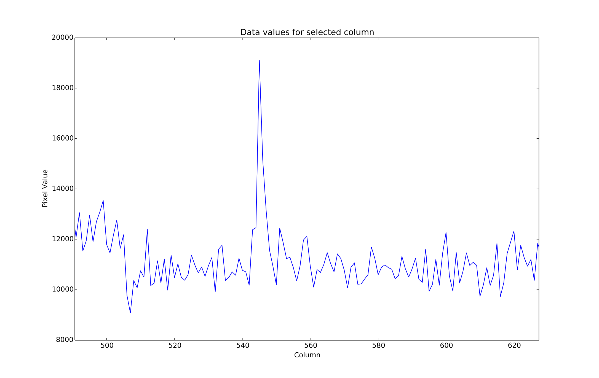
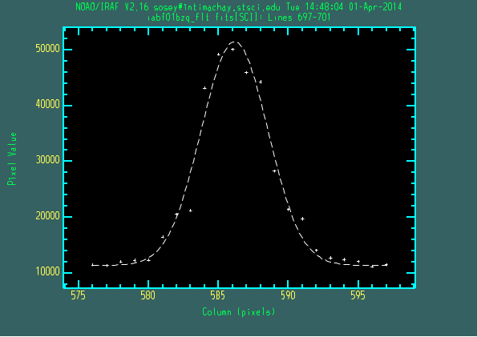

Comparison with the IRAF verison of imexamine
=============================================
The following is a comparison of the outputs, returned values and user options for this module versus imexamine in IRAF

* All plot types are replicated between the codes, though they may be rendered differently. The images below are representative of the basic plots from each package.
* The same user plot options, as in the rimexam, cimexam etc. type IRAF param files are replicated to their useful extent using python dictionaries for each imexamine key.
* Colormaps and point styles for the matplotlib plots may be changed by the user through the ``imexam`` key default dictionaries
* In ``imexam``, once the plot is displayed on the screen, you can zoom in and out using the controls in the plotting window.
* ``imexam`` allows users to register their own analysis functions
* ``imexam`` does not attempt to replicate the colon command interaction, if users wish to change the plot settings they should exit the imexam() method, reset the options and call it again.
* all of the imexam() functions in ``imexam`` can be called by themselves if you supply an x,y coordinate

How do the numerical results compare with the IRAF version? This is a little harder to judge with cursor centering.
Visual comparison of the resulting plots shows good agreement, as well as some random checks of the photometry and statistical return methods.

Statistical returns
^^^^^^^^^^^^^^^^^^^

IRAF "m" key:

::
        --> imexam

        #            SECTION     NPIX     MEAN   MEDIAN   STDDEV      MIN      MAX

        [584:588,697:701]       25   46533.   51314.   10281.   21215.   56186.

imexam "m" key (with cursor location flooring):

::

    [583:588,695:700] median: 51458.000000

``imexam`` only shows one statistic at a time. The same function call may be used to show the results from  *any* valid numpy function, it will return an attribute error for invalid functions.
For example, if you edit the defaults dictionary for the "m" key:

::

    viewer.mimexam()

        {'function': ['report_stat'],
         'region_size': [5, 'region size in pixels to use'],
         'stat': ['median',
         'which numpy stat to return [median,min,max...must map to a numpy func]']}

    viewer.exam.report_stat_pars["stat"][0] = "max"  <---- will report np.max for the array

        [584:589,695:700] amax: 56186.000000

    viewer.exam.report_stat_pars["stat"][0] = "mean"  <---- will report np.mean for the array

        [583:588,694:699] mean: 45412.878906

    viewer.exam.report_stat_pars["stat"][0]="std"

        [583:588,694:699] std: 10706.179688

Aperture Photometry
^^^^^^^^^^^^^^^^^^^

IRAF "a" key:

::

        #   COL    LINE   COORDINATES
        #     R    MAG    FLUX     SKY    PEAK    E   PA BETA ENCLOSED   MOFFAT DIRECT
        585.81  698.16 585.81 698.16
        17.51   8.86 2.858E6  10840.  45443. 0.03  -64 8.32     5.23     7.10   5.83

``imexam`` "a" key (using the defaults):

::

        xc=586.138728	yc=697.990516
        x	y	radius	flux	mag(zpt=25.00)	sky	fwhm
        586.14	697.99	5	1508664.63	9.55	11160.89	6.03

The "xc" and "yc" returns are the gaussian fit centers, as well as the FWHM from the fit.
If we set the values to be similar to what IRAF.imexamine used, we can see the numbers are closer, the radius for the apertures are floored though before being sent to photutil:

::

        viewer.aimexam()

        {'center': [True, 'Center the object location using a 2d gaussian fit'],
         'function': ['aperphot'],
         'radius': [5, 'Radius of aperture for star flux'],
         'skyrad': [15, 'Distance to start sky annulus is pixels'],
         'subsky': [True, 'Subtract a sky background?'],
         'width': [5, 'Width of sky annulus in pixels'],
         'zmag': [25.0, 'zeropoint for the magnitude calculation']}

        viewer.exam.aperphot_pars["radius"][0]=17.5

        xc=586.213790	yc=697.501845
        x	y	radius	flux	mag(zpt=25.00)	sky	fwhm
        586.21	697.50	17	2565167.11	8.98	11162.83	6.02

Radial Profile Plot
^^^^^^^^^^^^^^^^^^^

The fit profile of the star out to the specified radius.
Users can look at the fit profile of the star using the 1D gaussian option.
By default, ``imexam`` prints the data point values to the screen.

.. image:: ../_static/iraf_radial_plot.png
    :height: 400
    :width: 600
    :alt: IRAF radial plot

.. image:: ../_static/radial_profile_points.png
    :height: 400
    :width: 600
    :alt: imexam Radial Profile Plot

``imexam`` prints the plotted data to the screen

::

        pressed: r
        xc=655.659205	yc=698.937124
        Sky per pixel: 0.7021602984249302 using(rad=10.0->15.0)

        at (x,y)=655,698
        radii:[0 1 2 3 4 5 6 7 8 9]
        flux:[  74.23025852  153.66757441   60.17693806    9.7988813     7.10537578
            9.08464076    3.1673068     2.92777784    0.26435121    0.18440688]

Contour plot
^^^^^^^^^^^^
Note the added availability in this package for labeling the contours

.. image:: ../_static/iraf_contour_plot.png
    :height: 400
    :width: 600
    :alt: IRAF contour plot

.. image:: ../_static/contour_plot.png
    :height: 400
    :width: 600
    :alt: contour plot

Column and Line plots
^^^^^^^^^^^^^^^^^^^^^

.. image:: ../_static/iraf_column_plot.png
    :height: 400
    :width: 600
    :alt: IRAF column plot

.. image:: ../_static/column_plot.png
    :height: 400
    :width: 600
    :alt: Column plot

Keep in mind that python is 0-index and IRAF returns 1-index arrays, so the equivalent IRAF plot of 587 is really 588:

.. image:: ../_static/iraf_column_off1_plot.png
    :height: 400
    :width: 600
    :alt: IRAF column off by 1 plot

.

An added benefit in the python package is that you can zoom in and out of the plots using the window controls, below is a zoomed in area of the column plot as it appears in the window:

Histogram plots
^^^^^^^^^^^^^^^

.. image:: ../_static/iraf_histogram_plot.png
    :height: 400
    :width: 600
    :alt: IRAF histogram plot

.. image:: ../_static/histogram_plot.png
    :height: 400
    :width: 600
    :alt: histogram plot

``imexam`` prints bin information to the screen

::

    100 bins

1D Gaussian plots
^^^^^^^^^^^^^^^^^

These plots are representative for both the column and line versions

.. image:: ../_static/fit_line.png
    :height: 400
    :width: 600
    :alt: Plot of gaussian profile fit to data

``imexam`` prints the fit information to the screen

::

    xc=585.660034	yc=697.499370
    (585,697) mean=585.900, fwhm=5.653

Surface plots
^^^^^^^^^^^^^

The default viewing angle for this package was set to that the axis are easiest to read, the user may choose a different azimuthal value as well.
The most fancy ``imexam`` surface plot is displayed, the user can alter it with the available options.

.. image:: ../_static/iraf_surface_plot.png
    :height: 400
    :width: 600
    :alt: IRAF surface plot

.. image:: ../_static/fancy_surface.png
    :height: 460
    :width: 650
    :alt: fancy surface plot

.. image:: ../_static/surface_plot.png
    :height: 460
    :width: 650
    :alt: fancy surface plot
    
