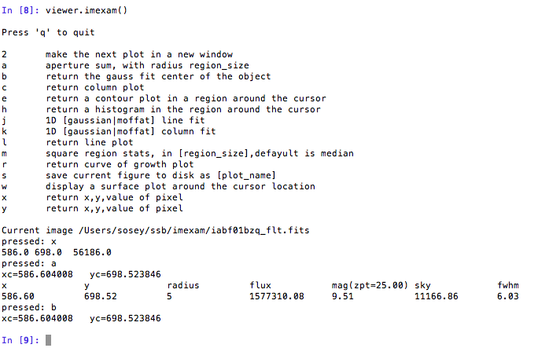
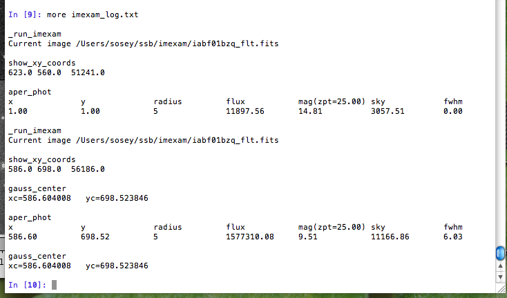

=====================
imexam User Methods
=====================
These are methods particular to the ``imexam`` package which are meant to aid users
in their image analysis. They are called from the main object you created
with imexam.connect().

At the top library level, the follow commands are available:::

    imexam.connect(): connect to a viewer and return a control object
    imexam.display_xpa_help(): Takes you to the XPA help page for DS9
    imexam.display_help(): Takes you to the help documents for your installed version of imexam
    imexam.defpars: contains the default plotting function dictionaries
    imexam.imexamine: this class contains the plotting functions and can be instantiated by itself
    imexam.set_logging(): set the logging parameters for your session. Each object has access to it's own logging which can be edited using viewer.setlog()
    imexam.list_active_ds9(): returns a dictionary of available DS9 sessions for connection

You can always get the commands available to your local viewer by asking the
control object for them directly. If you called your control object "viewer" then the following example will return the list:::

    viewer.show_window_commands()  # will return a list of available commands

Not all viewers have all commands implemented, commands which are available
but not yet fully implemented should return an error to that affect.

**alignwcs**\ (on=True):
    Align the images in the viewer using the WCS in their headers

    ::

        viewer.alignwcs()

**blink**\ (blink=True, interval=None):
    For viewers with multiple frames, blink the images

**clear_contour**\ ():
    Clear contours from the screen

**close**\ ():
    close the image viewing window and end the connection.

    ::

        viewer.close()

**cmap**\ (color=None, load=None, invert=False, save=False,filename='colormap.ds9'):
    Set the colormap for the window

**colorbar**\ (on=True):
    Turn the colorbar in the window on or off

**contour**\ (on=True, construct=True):
    Show contours in the window

**crosshair**\ (x=None, y=None, coordsys="physical", skyframe="wcs", skyformat="fk5", match=False, lock=False):
    Control the position of the crosshair in the current frame

**cursor**\ (x=None, y=None):
    Move the cursor in the window to the specified pixel location

**disp_header**\ ():
    Display the image header

**frame**\ (n=None):
    Convenience function to change or report the frame

**get_data**\ ():
    Return a numpy array of the data displayed in the current frame

**get_filename**\ ():
    Return the filename for the data in the current window

    ::

        In [1]: viewer.get_data_filename()
        Out[2]: '/Users/sosey/ssb/imexam/iabf01bzq_flt.fits'

**get_frame_info**\ ():
    Return more explicit information about the data displayed in the current
    frame. A dictionary of the information is returned.

    ::

        In [1]: viewer.get_frame_info()

            {'extname': 'SCI',
            'extver': 1,
            'filename': '/Users/sosey/ssb/imexam/iabf01bzq_flt.fits',
            'iscube': False,
            'mef': True,
            'naxis': 0,
            'numaxis': 2,
            'user_array': None}

**get_header**\ ():
    Return the header of the dataset in the current frame

**get_image**\ ():
    Return the full image object for the data in the current frame

**get_slice_info**\ ():
    Return the slice tuple for the image currently displayed

**get_viewer_info**\ ():
    Return a dictionary which contains information about all frames which have
    data loaded. This could be useful to users who are scripting an analysis
    for polling what items are available, how many frames or displayed, what
    type of data is hanging around, etc ...

    ::

        In [1]: viewer.get_viewer_info()

        {'1': {'extname': 'SCI',
          'extver': 1,
          'filename': '/Users/sosey/ssb/imexam/iabf01bzq_flt.fits',
          'iscube': False,
          'mef': True,
          'naxis': 0,
          'numaxis': 2,
          'user_array': None}}

**grab**\ ():
    Take a snapshop of the image view

**grid**\ (on=True, param=False):
    Turn a grid on and off in the window

**hideme**\ ():
    Reduce the precedence of the window

**iscube**\ ():
    Boolean return if the image is multidimensional cube

**load_fits**\ (fname="", extver=1, extname=None):
    Load a fits image into the current frame

**load_mef_as_cube**\ (filename=None):
    Load a Mult-Extension-Fits image into one frame as an image cube

**load_mef_as_multi**\ (filename=None):
    Load a Mult-Extension-Fits image into multiple frames

**load_region**\ (filename):
    Load regions from a file which uses standard formatting

**load_rgb**\ (red, green, blue, scale=False, lockwcs=False):
    Load three images into an RGB colored frame

**make_region**\ (infile,doLabels=False):
    Make an input reg file which contains rows with  "x,y,comment" into a
    region file that the DS9 viewer recognizes.

    infile: str
        input filename

    labels: bool
        add labels to the regions

    header: int
        number of header lines in text file to skip

    textoff: int
        offset in pixels for labels

    rtype: str
        region type, one of the acceptable DS9 regions

    size: int
        size of the region type

    ::

        Here's what the input file 'test' looks like:

        100,100, 1
        200,200, 2
        300,300, comment 3

        viewer.make_region('test',labels=True)

        And the output region file:

        image; circle(100,100,5)
        image;text(110.0,110.0{ 1 })# font="time 12 bold"
        image; circle(200,200,5)
        image;text(210.0,210.0{ 2 })# font="time 12 bold"
        image; circle(300,300,5)
        image;text(310.0,310.0{ comment 3 })# font="time 12 bold"

Now let's load the region file into our image:

.. image:: ../_static/make_region.png
    :height: 600
    :width: 500
    :alt: image with regions plotted

**mark_region_from_array**\ (input_points,rtype="circle",ptype="image",textoff=10,size=5):
    mark regions on the display given a list of tuples, a single tuple, or
    a string, where each object has x,y,comment specified

    input_points: an iterable
        contains: (x,y,comment) tuples
    ptype: string
        the reference system for the point locations, image|physical|fk5
    rtype: string
        the matplotlib style marker type to display
    size: int
        the size of the region marker

    textoff: string
        the offset for the comment text, if comment is empty it will not show

    ::

        locations=list()
        locations.append( (100,100,1) )
        locations.append( (200,200,2) )
        locations.append( (300,300,'comment 3') )

        viewer.mark_region_from_array(locations)

.. image:: ../_static/mark_region.png
    :height: 600
    :width: 500
    :alt: image with regions plotted

**match**\ (coordsys="wcs", frame=True, crop=False, fslice=False,
          scale=False, bin=False, colorbar=False, smooth=False,
          crosshair=False):

    Match all other frames to the current frame

**nancolor**\ (color='red'):
    Set the not-a-number color

**panto_image**\ (x, y):
    Convenience function to change to x,y  physical image coordinates

**panto_wcs**\ (x, y, system='fk5'):
    Pan to the wcs location in the image

**readcursor**\ ():
    Returns image coordinate postion and key pressed as a tuple of the
    for float(x), float(y), str(key).

    ::

        In [1]: viewer.readcursor()
        Out[2]: (56.0, 28.333333, 'a')

        or with a click of the first mouse button

        In [1]: viewer.readcursor()
        Out[2]: (67.333333, 80.0, '<1>')

**reopen**\ ():
    Reopen a closed viewing window, mostly used for ginga windows right now

**rotate**\ (value=None, to=False):
    Rotate the current frame (in degrees)

**save_regions**\ (filename=None):
    Save the regions currently displayed in the window to a regions file

**save_rgb**\ (filename=None):
    Save an rgbimage frame as an MEF fits file

**scale**\ (scale='zscale'):
    Scale the pixel values in the window, zscale is the default

**set_region**\ (region_string):
    Use this to send the DS9 viewer a formatted region string it's expecting

For example, in DS9::

    viewer.set_region("text 110.0 110.0 '1' #font=times")

    See the DS9 XPA documentation for more examples.

**show_xpa_commands**\ ():
    Print the available XPA commands (DS9 only)

**showme**\ ():
    Raise the precedence of the viewing window

**showpix**\ ():
    Display a pixel value table

**snapsave**\ (filename=None, format=None, resolution=100):
    Create a snapshot of the current window in the specified format

**valid_data_in_viewer**\ ():
    Return bool if valid file or array is loaded into the viewer

**view**\ (img, header=None, frame=None, asFits=False):
    Load an image array into the image viewing frame, if no frame is specified,
    the current frame is used. If no frame exists, then a new one is created.
    A basic header is created and sent to DS9. You can look at this header
    with disp_header() but get_header() will return an error because it looks
    for a filename, and no file was loaded, just the array.

    ::

        image_array=fits.getdata('image.fits')
        viewer.view(image_array)

        or

        image_array=numpy.ones([100,100])*numpy.random.rand(100)
        viewer.view(image_array)

**zoom**\ (par=None):
    Zoom using the specified command in par

**zoomtofit**\ ():
    Zoom the image to fit the window

**setlog**\ (self, filename=None, on=True, level=logging.DEBUG):
    Turn on and off ``imexam`` logging to the a file. You can set the filename to
    something specific or let the package record to the default logfile.
    Once you give the object a logfile name, it will continue to use that
    file until you change it.

    ::

        In [5]: viewer.setlog()
        Saving ``imexam`` commands to imexam_log.txt

This is what's displayed in the terminal when you use imexam():

and this is what shows up in the logfile:

You can see there are some leftovers from a previous logging session to the
same file. You can toggle logging during a session too:

    ::

        viewer.setlog(on=False)

        #and to turn off even messages to the screen:

        viewer.setlog(on=False,level=logging.CRITICAL)

**unlearn**\ ():
    Reset all the ``imexam`` default function parameters

**plotname**\ ():
    change or show the default save plotname for imexamine

    ::

        In [1]: viewer.plotname()
        imexam_plot.pdf

        In [2]: viewer.plotname('myplot.jpg')
        In [3]: viewer.plotname()
        myplot.jpg

The extension of the filename controls the plot type.

**display_help**\ ():
    Display the help documentation into a webpage from the locally installed
    version. This is done from the main package:

    ::

        In [1]: import imexam

        In [2]: imexam.display_help()
