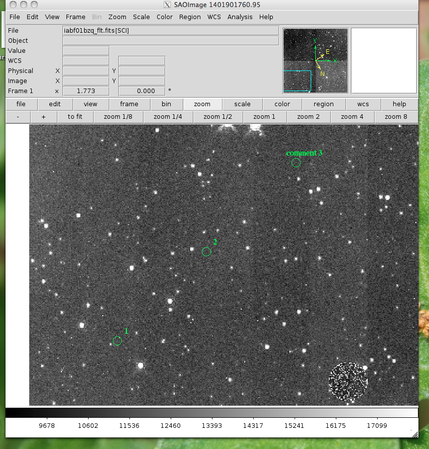

**************************
imexam() User Methods
**************************
These are methods particular to the imexam package which are meant to aid users in their image analysis. They are called from the main object you created with imexam.connect().

**close** ():
    close the image viewing window and end the connection.
            
    ::
    
        viewer.close()

**view** (img, header=None, frame=None, asFits=False): 
    Load an image array into the image viewing frame, if no frame is specified, the current frame is used. If no frame exists, then a new one is created.
    A basic header is created and sent to DS9. You can look at this header with disp_header() but get_header() will return an error because it 
    looks for a filename, and no file was loaded, just the array. No header is sent to the Ginga widget.

    ::
               
        image_array=fits.getdata('image.fits')
        viewer.view(image_array)

        or

        image_array=numpy.ones([100,100])*numpy.random.rand(100)
        viewer.view(image_array)

**readcursor** (): 
    Returns image coordinate postion and key pressed as a tuple of the for float(x), float(y), str(key).
    
    :: 
        
        In [1]: viewer.readcursor()
        Out[2]: (56.0, 28.333333, 'a')

        or with a click of the first mouse button

        In [1]: viewer.readcursor()
        Out[2]: (67.333333, 80.0, '<1>')

        

**make_region** (infile,doLabels=False): 
    Make an input reg file which contains rows with  "x,y,comment" into a region file that the DS9 viewer recognizes.

    infile: str
        input filename

    labels: bool
        add labels to the regions

    header: int
        number of header lines in text file to skip

    textoff: int
        offset in pixels for labels

    rtype: str
        region type, one of the acceptable DS9 regions

    size: int
        size of the region type
        
    ::
    
        Here's what the input file 'test' looks like:
        
        100,100, 1
        200,200, 2
        300,300, comment 3
        
        
        viewer.make_region('test',labels=True)
        
        And the output region file:
        
        image; circle(100,100,5)
        image;text(110.0,110.0{ 1 })# font="time 12 bold"
        image; circle(200,200,5)
        image;text(210.0,210.0{ 2 })# font="time 12 bold"
        image; circle(300,300,5)
        image;text(310.0,310.0{ comment 3 })# font="time 12 bold"

Now let's load the region file into our image:

**mark_region_from_array** (input_points,rtype="circle",ptype="image",textoff=10,size=5):
    mark regions on the display given a list of tuples, a single tuple, or a string, where each object has x,y,comment specified

    input_points: a tuple, or list of tuples, or a string which contain: (x,y,comment), 

    ptype: string
        the reference system for the point locations, image|physical|fk5
    rtype: string
        the matplotlib style marker type to display
    size: int
        the size of the region marker

    textoff: string
        the offset for the comment text, if comment is empty it will not show
    
    
    ::
    
        locations=list()
        locations.append( (100,100,1) )
        locations.append( (200,200,2) )
        locations.append( (300,300,'comment 3') )
        
        viewer.mark_region_from_array(locations)
        
.. image:: mark_region.png
    :height: 600
    :width: 500
    :alt: image with regions plotted
        

**setlog** (self, filename=None, on=True, level=logging.DEBUG):
    Turn on and off imexam logging to the a file. You can set the filename to something specific or let the package record to the default logfile.
    Once you give the object a logfile name, it will continue to use that file until you change it.
    
    ::
    
        In [5]: viewer.setlog()
        Saving imexam commands to imexam_log.txt

This is what's displayed in the terminal when you use imexam():
    
.. image:: setlog1.png
    :height: 500
    :width: 600
    :alt: log information to terminal
    
    
and this is what shows up in the logfile:

.. image:: setlog2.png
    :height: 500
    :width: 600
    :alt: log information to terminal

You can see there are some leftovers from a previous logging session to the same file. You can toggle logging during a session too:

    ::
    
        viewer.setlog(on=False)
        

**set_region** (region_string):
    Use this to send the DS9 viewer a formatted region string it's expecting
    
For example, in DS9::

    viewer.set_region("text 110.0 110.0 '1' #font=times") 
    
    
    See the DS9 XPA documentation for more examples.
    
**unlearn** ():
    Reset all the imexam default parameters

**get_data_filename** ():
    Return the filename for the data in the current window
    
    ::
        
        In [1]: viewer.get_data_filename()
        Out[2]: '/Users/sosey/ssb/imexam/iabf01bzq_flt.fits'

**get_frame_info** ():
    Return more explicit information about the data displayed in the current frame. A dictionary of the information is returned. 
    
    ::
    
        In [1]: viewer.get_frame_info()
        
            {'extname': 'SCI',
            'extver': 1,
            'filename': '/Users/sosey/ssb/imexam/iabf01bzq_flt.fits',
            'iscube': False,
            'mef': True,
            'naxis': 0,
            'numaxis': 2,
            'user_array': None}

**get_viewer_info** ():
    Return a dictionary which contains information about all frames which have data loaded.
    This could be useful to users who are scripting an analysis for polling what items are available, 
    how many frames or displayed, what type of data is hanging around, etc ... 
    
    ::
        
        In [1]: viewer.get_viewer_info()
        
        {'1': {'extname': 'SCI',
          'extver': 1,
          'filename': '/Users/sosey/ssb/imexam/iabf01bzq_flt.fits',
          'iscube': False,
          'mef': True,
          'naxis': 0,
          'numaxis': 2,
          'user_array': None}}

**plotname**:
    change or show the default save plotname for imexamine
    
    ::
    
        In [1]: viewer.plotname()
        imexam_plot.pdf

        In [2]: viewer.plotname('myplot.jpg')
        In [3]: viewer.plotname()
        myplot.jpg

The extension of the filename controls the plot type.

**display_help**():
    Display the help documentation into a webpage from the locally installed version. This is done from the main package:
    
    ::
    
        In [1]: import imexam
        
        In [2]: imexam.display_help()
        
        

