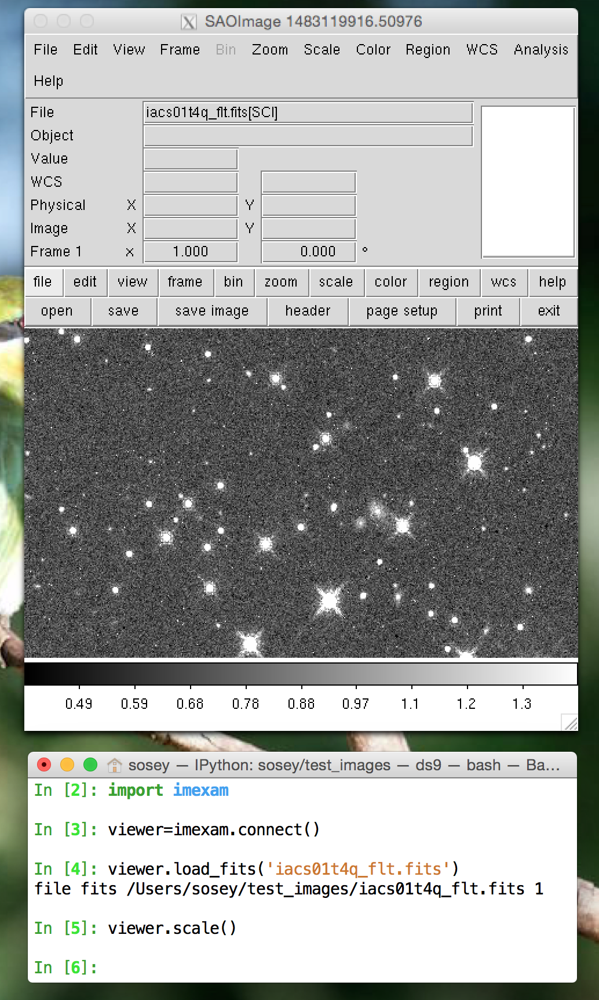
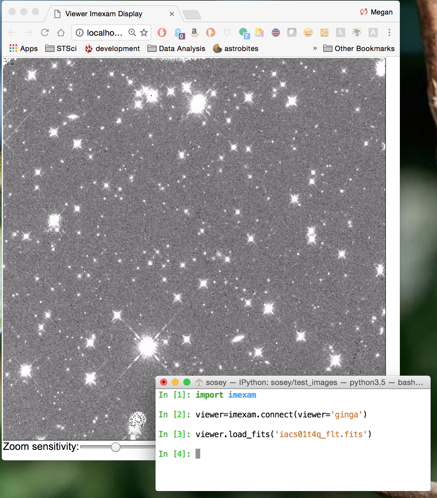

=========
Example 1
=========

.. note:: More examples in the form of Jupyter notebooks can be downloaded from the git repository and are contained in the "example_notebooks" directory.

Basic Usage
-----------

First you need to import the package
::

    import imexam

Usage with D9 (the current default viewer)
------------------------------------------

Start up a ``DS9`` window (by default), a new ``DS9`` window will be opened, open a fits image, and scale it::

    viewer=imexam.connect()
    viewer.load_fits('iacs01t4q_flt.fits')
    viewer.scale()

If you already have a window running, you can ask for a list of windows; windows that you start from the ``imexam`` package will not show up, this is to keep control over their processes and prevent double assignments.

::

    # This will display if you've used the default command above and have no other DS9 windows open
    In [1]: imexam.list_active_ds9()
    No active sessions registered
    Out[2]: {}

    # open a window in another process
    In [3]: !ds9&
    In [4]: imexam.list_active_ds9()
    DS9 ds9 gs /tmp/xpa/DS9_ds9.60457 sosey
    Out[5]: {'/tmp/xpa/DS9_ds9.60457': ('ds9', 'sosey', 'DS9', 'gs')}imexam.list_active_ds9()
    DS9 ds9 gs 82a7e75f:57222 sosey

You can attach to a current ``DS9`` window be specifying its unique name
::

    viewer1=imexam.connect('ds9')

If you haven't given your windows unique names using the ``-t <name>`` option from the commandline, then you must use the ip:port address::

    viewer=imexam.connect('82a7e75f:57222')

Usage with Ginga viewer
-----------------------

Start up a ginga window using the HTML5 backend and display the same image as above. Make sure that you have installed the most recent version of ginga, ``imexam`` will return an error that the viewer cannot be found otherwise.::

    viewer=imexam.connect(viewer='ginga')
    viewer.load_fits()

.. note:: All commands after your chosen viewer is opened are the same. Each viewer also has it's own set of commands which you can additionally use. You may use any viewer for the examples which follow.

Load a fits image into the window::

    viewer.load_fits('test.fits')

Scale the image to the default scaling, which is a zscale algorithm, but the viewers other scaling options are also available::

    viewer.scale()
    viewer.scale('asinh')  <-- uses asinh

Change to heat map colorscheme::

    viewer.cmap(color='heat')

Make some marks on the image and save the regions using a ``DS9`` style regions file::

    viewer.save_regions('test.reg')

Delete all the regions you made, then load from file::

    viewer.load_regions('test.reg')

Plot stuff at the cursor location, in a while loop. Type a key when the mouse is over your desired location and continue plotting with the available options::

    viewer.imexam()

Quit out and delete windows and references, for the ginga HTML5 window, this will not close the browser window with the image display, you'll need to exit that manually. However, if you've accidentally closed that window you can reopen and reconnect to the server::

    viewer.close()
    viewer.reopen()
