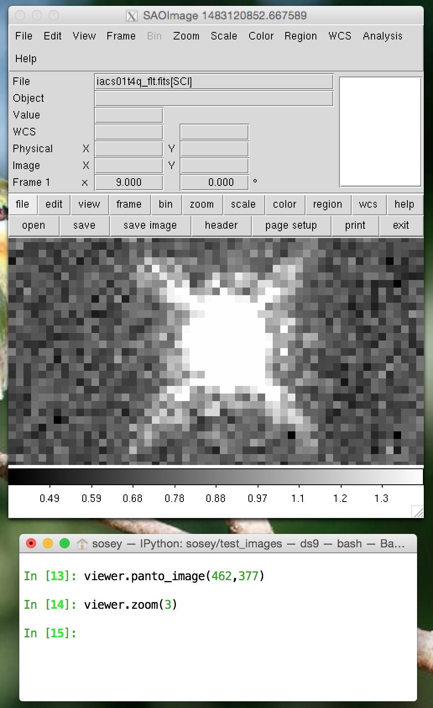
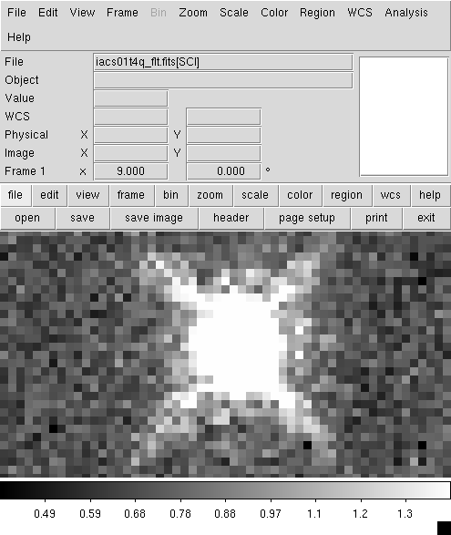
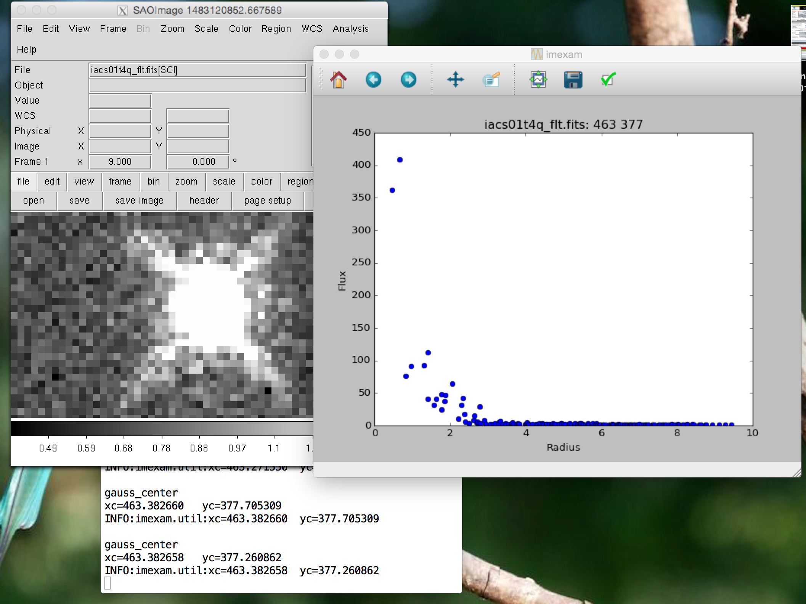
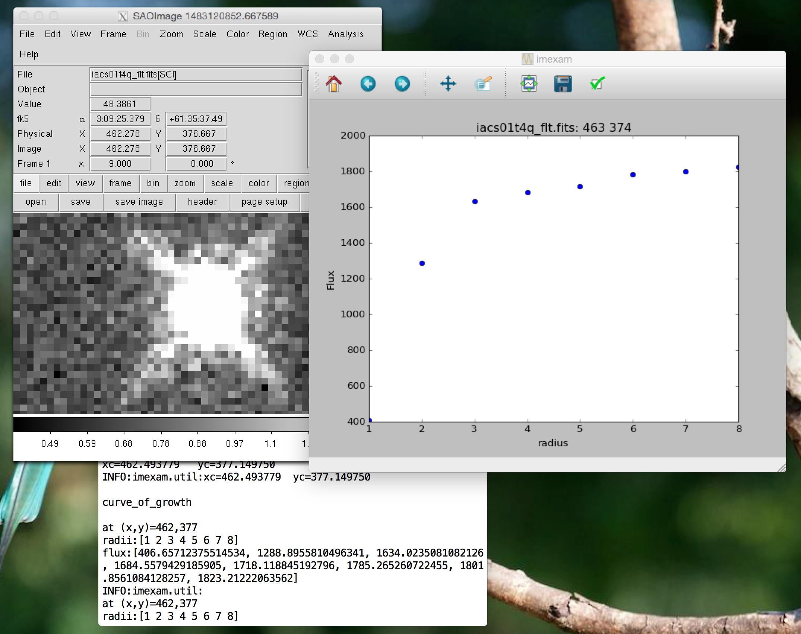
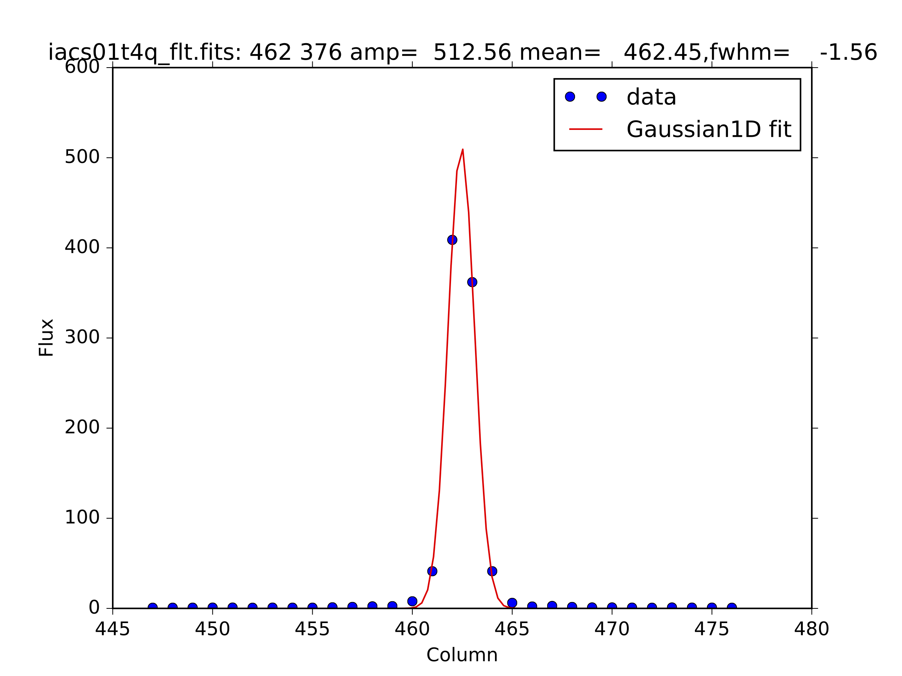

=========
Example 2
=========

Aperture Photometry
-------------------
* Perform manual aperture photometry on supplied image
* Make curve of growth and radial profile plots
* Save the profile data and plot to files.

Method 1
^^^^^^^^

Assuming we've already connected to the  window where the data is displayed:

* This method first uses the "a" key to check out the aperture photometry with the default settings
* Display a radial profile "r" plot around the start we choose
* Look at the curve of growth "g" plot
* Make a new profile plot, print the plotted points to the screen, and save a copy of the plotting window for reference

Here a picture of the area I'm looking at on my desktop:

If you wanted to save a screenshot of the viewer display you can use viewer.grab(), in ``DS9`` this will save a snap of the whole ``DS9`` window for reference:

Now let's start up the ``imexam()`` loop and look at a plot of star::

        viewer.imexam() #start an imexam session

Use the "r" and "g" keys to look at the radial profile and growth curves:

Note that part of the screen information that's returned includes the flux and radii information:

Let's take this information and set the radii for our quick aperture photometry::

    In [1]: viewer.aimexam()
    Out[2]:
    {'center': [True, 'Center the object location using a 2d gaussian fit'],
    'function': ['aper_phot'],
    'radius': [5, 'Radius of aperture for star flux'],
    'skyrad': [15, 'Distance to start sky annulus is pixels'],
    'subsky': [True, 'Subtract a sky background?'],
    'width': [5, 'Width of sky annulus in pixels'],
    'zmag': [25.0, 'zeropoint for the magnitude calculation']}

    In [3]: viewer.set_plot_pars('a','radius',4)
    set aper_phot_pars: radius to 4

    In [4]: viewer.set_plot_pars('a','skyrad',8)
    set aper_phot_pars: skyrad to 8

    In [23]: viewer.imexam()

    Press 'q' to quit

    2	Make the next plot in a new window
    a	Aperture sum, with radius region_size
    b	Return the 2D gauss fit center of the object
    c	Return column plot
    e	Return a contour plot in a region around the cursor
    g	Return curve of growth plot
    h	Return a histogram in the region around the cursor
    j	1D [Gaussian1D default] line fit
    k	1D [Gaussian1D default] column fit
    l	Return line plot
    m	Square region stats, in [region_size],default is median
    r	Return the radial profile plot
    s	Save current figure to disk as [plot_name]
    t	Make a fits image cutout using pointer location
    w	Display a surface plot around the cursor location
    x	Return x,y,value of pixel
    y	Return x,y,value of pixel
    Current image /Users/sosey/test_images/iacs01t4q_flt.fits

    gauss_center
    xc=462.827108	yc=377.705312

    aper_phot
    x          y        radius    flux       mag(zpt=25.00)  sky    fwhm
    462.83     377.71   4         1686.24    16.93           0.92   1.71

Just for some more information on the star, below is the gaussian fit "j" to the columns of the same star.

Method 2
^^^^^^^^

Assuming we've already connected to the ``DS9`` window where the data is displayed:

* First we turn on logging so that everything gets saved to a file
* We then use the "a" key to check out the aperture photometry with the default settings
* Use the "g" to look at the curve of growth
* Adjust the aperture photometry with our our own settings
* We can then use the log file, to create a plot

::

    In [1]: viewer.setlog('mystar.log')
    Saving imexam commands to mystar.log
    In [2]: viewer.unlearn()

    In [3]: viewer.imexam()

    Press 'q' to quit

    2	Make the next plot in a new window
    a	Aperture sum, with radius region_size
    b	Return the 2D gauss fit center of the object
    c	Return column plot
    e	Return a contour plot in a region around the cursor
    g	Return curve of growth plot
    h	Return a histogram in the region around the cursor
    j	1D [Gaussian1D default] line fit
    k	1D [Gaussian1D default] column fit
    l	Return line plot
    m	Square region stats, in [region_size],default is median
    r	Return the radial profile plot
    s	Save current figure to disk as [plot_name]
    t	Make a fits image cutout using pointer location
    w	Display a surface plot around the cursor location
    x	Return x,y,value of pixel
    y	Return x,y,value of pixel
    Current image /Users/sosey/test_images/iacs01t4q_flt.fits

    xc=462.938220	yc=377.260860
    x          y        radius    flux       mag(zpt=25.00)  sky    fwhm
    462.94     377.26   5         1739.97    16.90           0.72   1.44

    at (x,y)=462,377
    radii:[1 2 3 4 5 6 7 8]
    flux:[406.65712375514534, 1288.8955810496341, 1634.0235081082126,
    1684.5579429185905, 1718.118845192796, 1785.265260722455,
    1801.8561084128257, 1823.21222063562]

Lets get some more aperture photometry at larger radii by resetting some of the "a" key values:::

    In [4]: viewer.set_plot_pars("a","radius",4)
    set aper_phot_pars: radius to 4

    In [5]: viewer.set_plot_pars("a","skyrad",8)
    set aper_phot_pars: skyrad to 8

    In [5]: viewer.imexam()  #use the "a" key

    xc=463.049330	yc=377.038640
    x          y        radius    flux       mag(zpt=25.00)  sky    fwhm
    463.05     377.04   4         1679.23    16.94           0.93   1.71

This is what mystar.log contains, you can parse the log, or copy the data and use as you like to make interesting plots later or just have for reference.::

    gauss_center
    xc=462.938220   yc=377.260860

    aper_phot
    x          y        radius    flux       mag(zpt=25.00)  sky    fwhm
    462.94     377.26   5         1739.97    16.90           0.72   1.44

    gauss_center
    xc=462.827110   yc=377.371969

    gauss_center
    xc=462.827109   yc=377.260860

    gauss_center
    xc=462.827109   yc=377.260860

    curve_of_growth

    at (x,y)=462,377
    radii:[1 2 3 4 5 6 7 8]
    flux:[406.65712375514534, 1288.8955810496341, 1634.0235081082126,
    1684.5579429185905, 1718.118845192796, 1785.265260722455,
    1801.8561084128257, 1823.21222063562]

    gauss_center
    xc=463.049330   yc=377.038640

    aper_phot
    x          y        radius    flux       mag(zpt=25.00)  sky    fwhm
    463.05     377.04   4         1679.23    16.94           0.93   1.71
