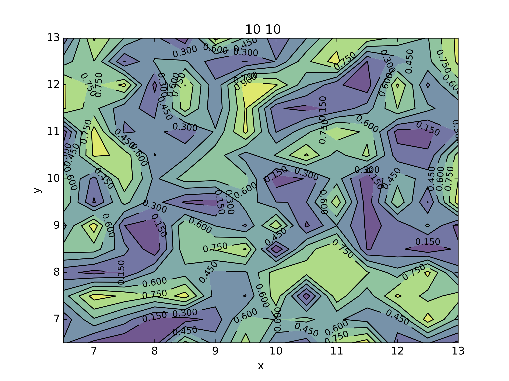
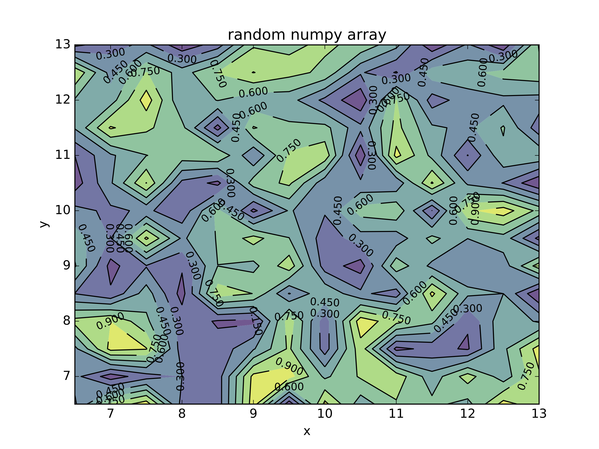

=========
Example 5
=========

Use the imexamine library standalone to create plots without viewing
--------------------------------------------------------------------

It's possible to use the imexamine library of plotting functions without loading
an image into the viewer. All of the functions take 3 inputs: the x, y, and data
array. In order to access the function, first create an imexamine object:

::

    from imexam.imexamine import Imexamine
    import numpy as np

    data=np.random.rand((100,100)) #create a random array thats 100x100 pixels
    plots=Imexamine()

These are the functions you now have access to:

::

        plots.aper_phot                 plots.contour_plot              plots.histogram_plot            plots.plot_line                 plots.set_colplot_pars          plots.set_surface_pars
        plots.aperphot_def_pars         plots.curve_of_growth_def_pars  plots.imexam_option_funcs       plots.plot_name                 plots.set_column_fit_pars       plots.show_xy_coords
        plots.aperphot_pars             plots.curve_of_growth_pars      plots.line_fit                  plots.print_options             plots.set_contour_pars          plots.showplt
        plots.colplot_def_pars          plots.curve_of_growth_plot      plots.line_fit_def_pars         plots.register                  plots.set_data                  plots.sleep_time
        plots.colplot_pars              plots.do_option                 plots.line_fit_pars             plots.report_stat               plots.set_histogram_pars        plots.surface_def_pars
        plots.column_fit                plots.gauss_center              plots.lineplot_def_pars         plots.report_stat_def_pars      plots.set_line_fit_pars         plots.surface_pars
        plots.column_fit_def_pars       plots.get_options               plots.lineplot_pars             plots.report_stat_pars          plots.set_lineplot_pars         plots.surface_plot
        plots.column_fit_pars           plots.get_plot_name             plots.new_plot_window           plots.reset_defpars             plots.set_option_funcs          plots.unlearn_all
        plots.contour_def_pars          plots.histogram_def_pars        plots.option_descrip            plots.save_figure               plots.set_plot_name
        plots.contour_pars              plots.histogram_pars            plots.plot_column               plots.set_aperphot_pars         plots.set_radial_pars

To create a plot, just specify the method:

::

    plots.plot_line(10,10,data)

produces the following plot:

.. image:: ../_static/imexamine_library_lineplot.png
    :height: 400
    :width: 400
    :alt: line plot generated without viewing

You can then save the current plot using the save method:

::

    plots.contour(10,10,data)
    plots.save() # with an optional filename using filename="something.extname"

    In [1]: plots.plot_name
    Out[2]: 'imexam.pdf'

    plots.close() # close the plot window

Where the extname specifies the format of the file, ex: jpg or pdf. A pdf file will be the default output, using the curent self.plot_name.

Note that no name is attached to the above contour plot because we plotted a data array. When you are using the plotting class without a viewer, you can attach any title you like by editing the plotting parameters using the dictionary directly:::

    plots.contour_pars['title'][0] = "random numpy array"

