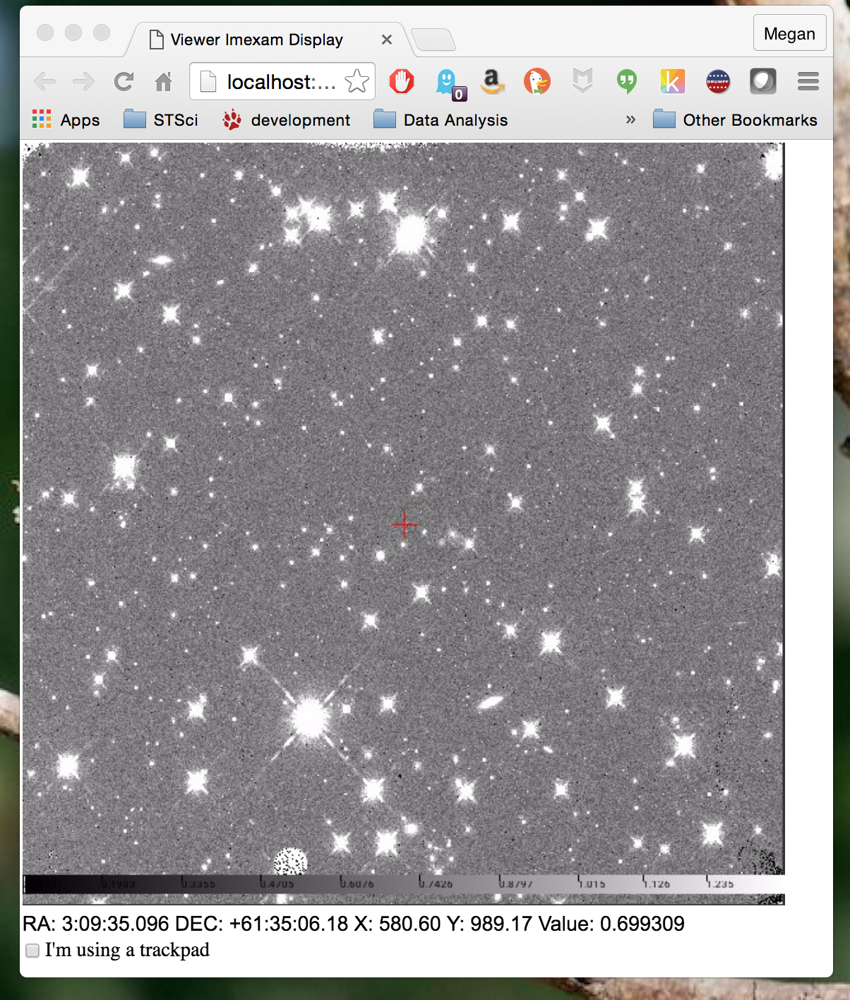
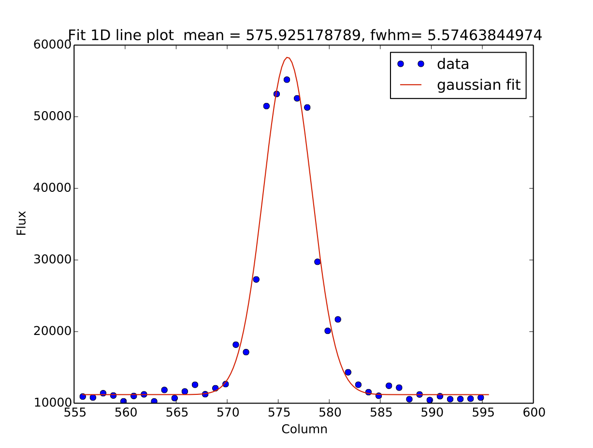
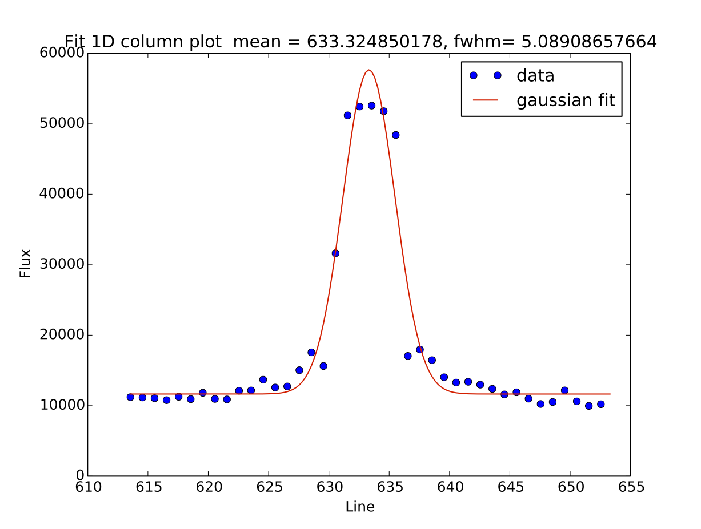
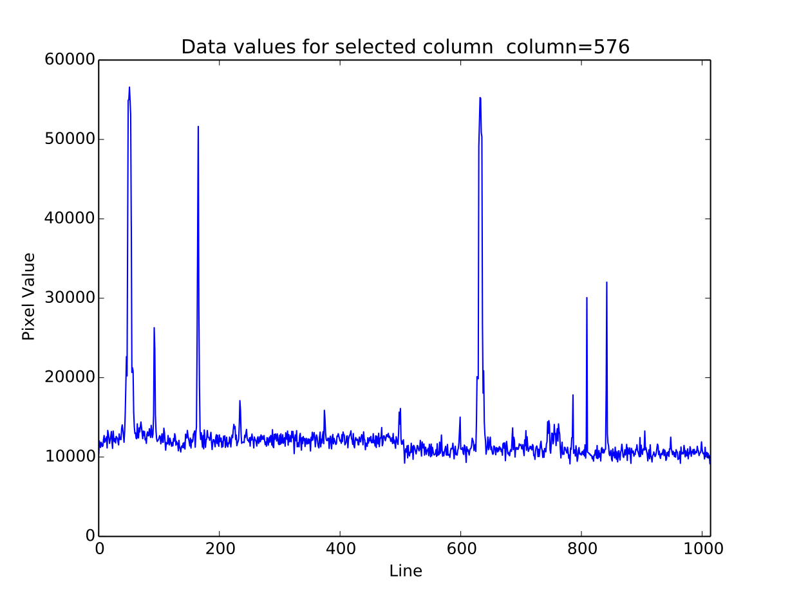
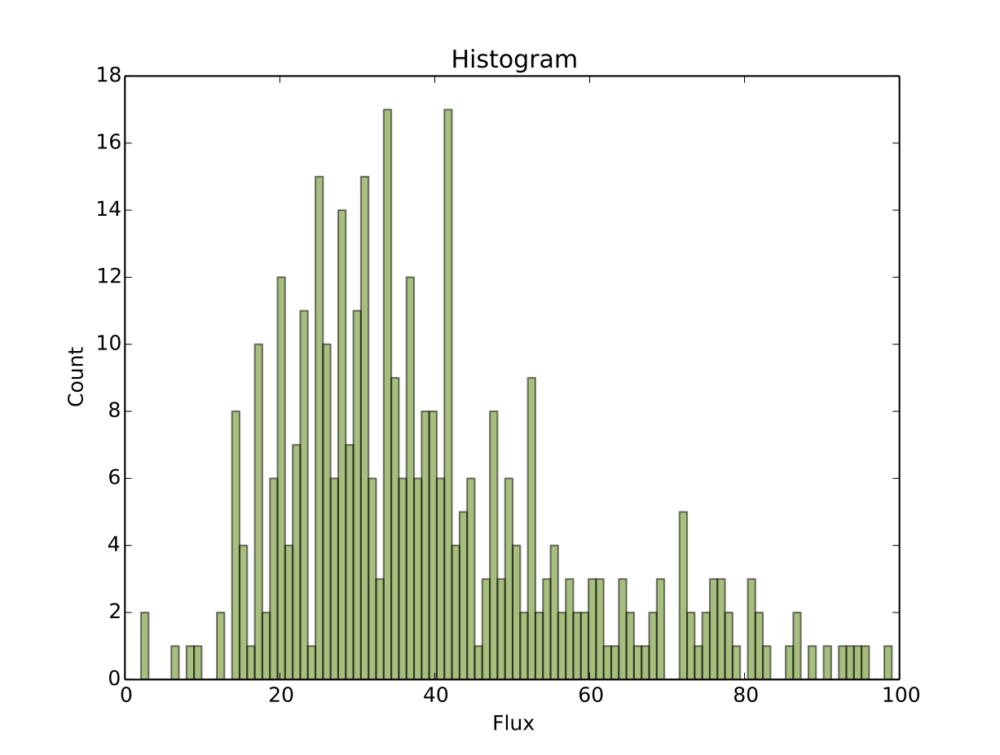
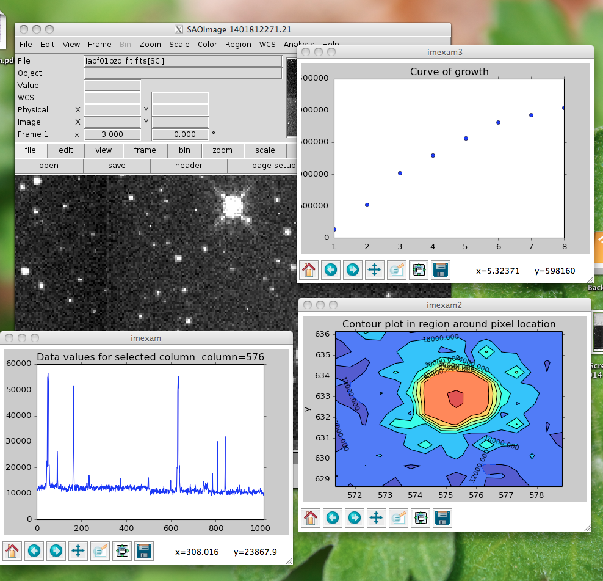
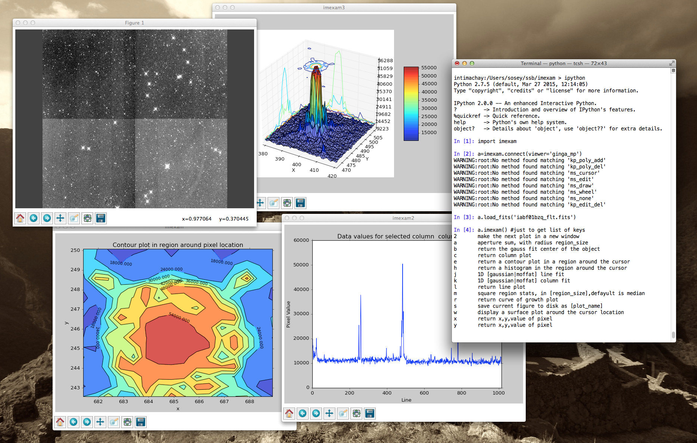

===================
The imexam() method
=================== 
This is the main method which allows live interaction with the image display when you are using the DS9 program for viewing your image or data array.  If you execute imexam() while using the Ginga widget, it will display the available options, however they are always available for use via keystroke and are event-driven (using the same keys described below). In order to turn the key-press capture on and off while you have your mouse in the Ginga widget press the "i" key. Either the "i" or "q" key can be used to quit out the exam. 

**imexam** (): 
    access realtime imexamine functions through the keyboard and mouse

**Current recognized keys for use during imexam are** ::

         'a': 'aperture sum, with radius region_size, optional sky subtraction ',
         'j': '1D  line fit ',
         'k': '1D  column fit ',
         'm': 'square region stats, in region_size square, default stat is median',
         'x': 'return x,y coords of pixel',
         'y': 'return x,y coords of pixel',
         'l': 'return line plot',
         'c': 'return column plot',
         'r': 'return curve of growth plot',
         'h': 'return a histogram in the region around the cursor'
         'e': 'return a contour plot in a region around the cursor'
         's': 'save current figure to plotname'
         'b': 'return the gauss fit center of the object'
         'w': 'display a surface plot around the cursor location'
         '2': 'make the next plot in a new window'
         
         aimexam(): return a dict of current parameters for aperture photometery
         
         cimexam(): return dict of current parameters for column plots

         eimexam(): return dict of current parameters for contour plots

         himexam(): return dict current parameters for histogram plots

         jimexam(): return dict current parameters for 1D gaussian line plots

         kimexam(): return dict of current parameters for 1D gaussian column plots

         limexam(): return dict of current parameters for  line plots

         rimexam(): return dict of current parameters for curve of growth plots

         wimexam(): return dict of current parameters for surface plots
    
         mimexam(): return dict of current parameters for area statistics
         
        
.. note:: Some of the plots accept a marker type, any valid Matplotlib marker may be specified. See this page for the full list: http://matplotlib.org/api/markers_api.html#module-matplotlib.markers   
 
        
The imexam key dictionary is stored inside the user object as  <object_name>.exam.imexam_option_funcs{}. Each key in the dictionary is the keyboard key to recognize from the user, it's associated value is a tuple which contains the name of the function to call and a description of what that function does. "q" is always assumed to be the returned key when the user wishes to quit interaction with the window. Users may change the default settings for each of the imexamine recognized keys by editing the associated dictionary. You can edit it directly, by accessing each of the values by their keyname and then reset mydict to values you prefer. You can also create a new dictionary of function which map to your own

Users may also add their own imexam keys and associated functions by registering them with the connect.register(user_funct=dict()) method. The new binding will bew added to the dictionary of imexamine functions as long as the key is unique. The new functions do not have to have default dictionaries association with them.

For all the examples below I will use the following session::

    #This will default to DS9 for the viewer

    import imexam
    viewer=imexam.connect()
    viewer.load_fits('iabf01bzq_flt.fits')
    viewer.scale()
    viewer.panto_image(576,633)
    viewer.zoom(3)
    

.. image:: imexam_command_example.png
    :height: 400
    :width: 400
    :alt: Data used for imexam command examples

    
    
    
This will use Ginga for the viewer::

    #Use Ginga for the image viewer
    
    import imexam
    viewer=imexam.connect(viewer='ginga_mp')
    viewer.load_fits('iabf01bzq_flt.fits')
    viewer.scale()
    viewer.panto_image(576,633)
    viewer.zoom(3)
    

Circular Apterture Photometry
^^^^^^^^^^^^^^^^^^^^^^^^^^^^^

Aperture photometry is performed when you press the "a" key. It is implemented using the `~photutils` python package, an affiliated package of astropy that is still in development.

Currently, the calculation which is performed is similar to the "," IRAF key. It is circular aperture photometry, centered on the mouse location at the time the key is pressed, with a background annulus subtraction for the sky. The radius of the aperture is set with the regsion_size keyword (default to 5 pixels). The annulus size is also set to the width, and taken a distance of skyrad pixels from the center. The pixels used to calculate the enclosed flux are those whose centers fall inside the radius distance, in the same way that IRAF imexamine computes the flux.

These are the default parameters for aperture photometry. They live in a dictionary in the exam object::

    viewer.exam.aperphot_pars= {"function":["aperphot",],
                    "center":[True,"Center the object location using a 2d gaussian fit"],
                    "width":[5,"Width of sky annulus in pixels"],
                    "subsky":[True,"Subtract a sky background?"],
                    "skyrad":[15,"Distance to start sky annulus is pixels"],
                    "radius":[5,"Radius of aperture for star flux"],
                    "zmag":[25.,"zeropoint for the magnitude calculation"],                
                    }

You can change the parameters by editing the dictionary, whose structure is { "parameter": [values, description] }. In order to change the width of the photometry aperture around the object you would do this ::

    viewer.exam.aperphot_pars["radius"][0] = 10
    
It might seem a little odd to non-python users at the moment. What you are doing is updating the value of the first item in that list. I intend on changing this interface to make it a little more seamless to users in the near future.

This is what the return looks like when you do photometry, where I've asked for photometry from the star circled in green above::

    viewer.imexam()
    
    Press 'q' to quit

    2	make the next plot in a new window
    a	aperture sum, with radius region_size 
    b	return the gauss fit center of the object
    c	return column plot
    e	return a contour plot in a region around the cursor
    h	return a histogram in the region around the cursor
    j	1D [gaussian|moffat] line fit 
    k	1D [gaussian|moffat] column fit
    l	return line plot
    m	square region stats, in [region_size],defayult is median
    r	return curve of growth plot
    s	save current figure to disk as [plot_name]
    w	display a surface plot around the cursor location
    x	return x,y,value of pixel
    y	return x,y,value of pixel

    xc=576.855763	yc=634.911425
    x              y              radius         flux           mag(zpt=25.00) sky            fwhm
    576.86         634.91         10             2191284.53     9.15           10998.89       5.58

xc = xcenter, yc=ycenter; these were found using a 2d gaussian fit centered on the pixel location of the mouse. You can turn the fit off by setting the "center" parameter to "False".

1D Gaussian or Moffat profile
^^^^^^^^^^^^^^^^^^^^^^^^^^^^^
If you press the "j" or "k" keys, a 1D gaussian profile is fit to the data in either the line or column of the current pointer location. A plot of both the data and the fit + parameters is displayed.
If the centering option is True, then the center of the flux is computed by fitting a 2d Gaussian to the data. ::
    
    
    line_fit_pars={"function":["line_fit",],
                   "func":["gaussian","function for fitting [gaussian|moffat]"],
                   "title":["Fit 1D line plot","Title of the plot"],
                   "xlabel":["Line","The string for the xaxis label"],
                   "ylabel":["Flux","The string for the yaxis label"],
                   "background":[False,"Solve for background? [bool]"],
                   "width":[10.0,"Background  width in pixels"],
                   "xorder":[0,"Background terms to fit, 0=median"],
                   "rplot":[20.,"Plotting radius in pixels"],
                   "pointmode":[True,"plot points instead of lines? [bool]"],
                   "logx":[False,"log scale x-axis?"],
                   "logy":[False,"log scale y-axis?"],
                   "center":[True,"Recenter around the local max"],
                   }

The column fit parameters are similar::

    column_fit_pars={"function":["column_fit",],
                     "func":["gaussian","function for fitting [gaussian|moffat]"],
                     "title":["Fit 1D column plot","Title of the plot"],
                     "xlabel":["Column","The string for the xaxis label"],
                     "ylabel":["Flux","The string for the yaxis label"],
                     "background":[False,"Solve for background? [bool]"],
                     "width":[10.0,"Background  width in pixels"],
                     "xorder":[0,"Background terms to fit, 0=median"],
                     "rplot":[20.,"Plotting radius in pixels"],
                     "pointmode":[True,"plot points instead of lines? [bool]"],
                     "logx":[False,"log scale x-axis?"],
                     "logy":[False,"log scale y-axis?"],
                     "center":[True,"Recenter around the local max"],
                     }
    
This is the resulting line fit:
    

and the corresponding column fit:

Median square region stats
^^^^^^^^^^^^^^^^^^^^^^^^^^
If you press the "m" key, the  pixel values around the pointer location are calculated inside a box which has a side equal to the region_size, defaulted to 5 pixels, and using the statistical function chosen.
The user can map the function to any reasonable numpy function, it's set to numpy.median by default

::

    report_stat_pars= {"function":["report_stat",],
                        "stat":["median","which numpy stat to return [median,min,max...must map to numpy func]"],
                        "region_size":[5,"region size in pixels to use"],
                    }

    [573:578,629:634] median: 50632.000000

You can change the statistic reported by changing the "stat" parameter::

    viewer.exam.report_stat_pars["stat"][0]="max"
    
    [572:577,629:634] amax: 55271.000000

You can make a quick comparison of the max reported above with the line fit graph in the 1D gaussian profile example.

Pixel Coordinates and Value
^^^^^^^^^^^^^^^^^^^^^^^^^^^
Hitting the 'x' or 'y' will return the x,y coordinate and pixel value under the mouse pointer.::

    576.0 633.66667  55271.0
  

Line or Column plots
^^^^^^^^^^^^^^^^^^^^
Pressing the "l" or "c" keys will display a plot of the points through either the line or column closest to the cursor location.

.. image:: line_plot.png
    :height: 400
    :width: 600
    :alt: Line plot

Curve of Growth plot
^^^^^^^^^^^^^^^^^^^^
Pressing the "r" key displays a curve of growth for the flux around the current pointer location in successively larger radii. 
If centering is on, the center is computed close to the star using a 2d gaussian fit.

The available parameters are ::
    
    curve_of_growth_pars={"function":["curve_of_growth_plot",],
                          "title":["Curve of Growth","Title of the plot"],
                          "xlabel":["radius","The string for the xaxis label"],
                          "ylabel":["Flux","The string for the yaxis label"],
                          "center":[True,"Solve for center using 2d Gaussian? [bool]"],
                          "background":[True,"Fit and subtract background? [bool]"],
                          "buffer":[25.,"Background inner radius in pixels,from center of star"],
                          "width":[5.,"Background annulus width in pixels"],
                          "magzero":[25.,"magnitude zero point"],
                          "rplot":[8.,"Plotting radius in pixels"],
                          "pointmode":[True,"plot points instead of lines? [bool]"],
                          "marker":["o","The marker character to use, matplotlib style"],
                          "logx":[False,"log scale x-axis?"],
                          "logy":[False,"log scale y-axis?"],
                          "minflux":[0., "only measure flux above this value"],
                          }

.. image:: radial_profile.png
    :height: 400
    :width: 600
    :alt: Curve of growth  plot around star

Returned to the screen is the data information from the plot, the (x,y) location of the center, followed by the radius and corresponding flux which was measured::
    
    viewer.exam.curve_of_growth_pars["rplot"][0]=25  #set the default radius larger

    xc=577.242311	yc=634.578361

    at (x,y)=577,634
    radii:[ 1  2  3  4  5  6  7  8  9 10 11 12 13 14 15 16 17 18 19 20 21 22 23 24 25]
    flux:[131192.03694247041, 489485.48536408512, 911376.50226695999, 1301726.7189847208, 1547865.8684735354, 1777547.7859571185, 1940955.1267221647, 2047700.7156964755, 2165971.1952809561, 2280391.5901085823, 2376090.3555588746, 2458370.0006153183, 2523384.2243051622, 2575208.3657517368, 2609309.6524876151, 2643279.3635597304, 2672443.1546003688, 2687659.5178374872, 2702128.5513395425, 2709501.1520242952, 2720134.8632924128, 2734777.3482598308, 2746056.5231984705, 2770352.0070485324, 2781242.3299104609]

Histogram Plots
^^^^^^^^^^^^^^^

Pressing the "h" key will display a histogram of pixel values around the pixel location under the mouse pointer. ::
    
    histogram_pars={"function":["histogram",],
                    "title":["Histogram","Title of the plot"],
                    "xlabel":["Flux (bin)","The string for the xaxis label"],
                    "ylabel":["Count","The string for the yaxis label"],
                    "ncolumns":[21,"Number of columns"],
                    "nlines":[21,"Number of lines"],
                    "nbins":[100,"Number of bins"],
                    "z1":[None,"Minimum histogram intensity"],
                    "z2":[100,"Maximum histogram intensity"],
                    "pointmode":[True,"plot points instead of lines? [bool]"],
                    "marker":["o","The marker character to use, matplotlib style"],
                    "logx":[False,"log scale x-axis?"],
                    "logy":[False,"log scale y-axis?"],
                    }

Contour Plots
^^^^^^^^^^^^^

Pressing the "e" key will display  a contour plot around the clicked pixel location. ::
    
    contour_pars={"function":["contour",],
                       "title":["Contour plot in region around pixel location","Title of the plot"],
                       "xlabel":["x","The string for the xaxis label"],
                       "ylabel":["y","The string for the yaxis label"],
                       "ncolumns":[15,"Number of columns"],
                       "nlines":[15,"Number of lines"],
                       "floor":[None,"Minimum value to be contoured"],
                       "ceiling":[None,"Maximum value to be contoured"],
                       "ncontours":[8,"Number of contours to be drawn"],
                       "linestyle":["--","matplotlib linestyle"],
                       "label":[True,"Label major contours with their values? [bool]"],
                       "cmap":["jet","Colormap (matplotlib style) for image"],
                       }

.. image:: contour_plot.png
    :height: 400
    :width: 600
    :alt: contour plot
    
Here's what it looks like if we change some of the default parameters::

    viewer.exam.contour_pars["cmap"][0]="gist_heat"
    viewer.exam.contour_pars["title"][0]="Contours around my favorite star"
    viewer.exam.contour_pars["ncontours"][0]=4
    viewer.exam.contour_pars["floor"][0]=0 

.. image:: contour_plot2.png
    :height: 400
    :width: 600
    :alt: contour plot

.. note:: You can use any of the matplotlib standard cmaps, see here for more information: http://matplotlib.org/api/pyplot_summary.html?highlight=colormaps#matplotlib.pyplot.colormaps 

Surface Plots
^^^^^^^^^^^^^

Pressing the "s" key will display a 3D surface plot of pixel values around the mouse pointer location::
    
    viewer.exam.surface_pars={"function":["surface",],
                       "title":["Surface plot","Title of the plot"],
                       "xlabel":["X","The string for the xaxis label"],
                       "ylabel":["Y","The string for the yaxis label"],
                       "zlabel":[None,"Label for zaxis"],
                       "ncolumns":[21,"Number of columns"],
                       "nlines":[21,"Number of lines"],
                       "azim":[None,"azimuthal viewing angle in degrees"],
                       "floor":[None,"Minimum value to be contoured"],
                       "ceiling":[None,"Maximum value to be contoured"],
                       "stride":[2,"step size, higher vals will have less contour"],
                       "cmap":["jet","colormap (matplotlib) for display"],
                       "fancy":[False,"This aint your grandpas iraf"],
                       }

.. image:: surface_plot.png
    :height: 600
    :width: 800
    :alt: surface plot

Or, if you'd like to get fancy and add some nice contours:

.. image:: fancy_surface.png
    :height: 600
    :width: 800
    :alt: fancy surface plot

User Specified Functions
^^^^^^^^^^^^^^^^^^^^^^^^

Users may code their own functions and bind them to keys by registering them with the imexam dictionary through the register method.
The new binding will be added to the dictionary of imexamine functions as long as the key is unique.
The new functions do not have to have default dictionaries associated with them. The binding is only good for the current object, new 
instantiations of imexam.connect() will not have the new function unless the user specifically registers them.

Here's all the code for a function which makes a cutout around the clicked pixel location and saves it to a fits file::

    def cutout(self,x,y,data):
        """Cut out an image from under the mouse and save it as a fits file"""
        import tempfile
        from astropy.io import fits
        size=20 #pixels
        cutout=data[y-size:y+size,x-size:x+size]
        prefix="cutout_{0}_{1}_".format(int(x),int(y))
        fname=tempfile.mktemp(prefix=prefix,suffix=".fits",dir="./")
        hdu=fits.PrimaryHDU(cutout)
        hdulist=fits.HDUList([hdu])
        hdulist[0].header['EXTEND']=False
        hdulist.writeto(fname)
        print("Cutout at ({0},{1}) saved to {2:s}".format(x,y,fname))        

Now, import that into your python session, file, or here I'll just copy paste the definition to the session. This is an important step becuase 
the function reference is what you are going to send to the registration method. The registration method wants you to supply a dictionary which 
contains the key you want to assign that function to during the imexam loop, and a tuple with the function name and description::        
        
    my_dict = {'t': (cutout, 'Cut out an image stamp from under the mouse and save it')}

    viewer.exam.register(my_dict)
    User function: cutout added to imexam options with key t

Okay, so let's try out our new function! We should be able to see it in the list of available options.

.. image:: user_func_1.png
    :height: 400
    :width: 600
    :alt: user function 1

Okay, I went to the star I like and pressed "t". Let's verify that we got what we wanted, it should be a cutout centered on the star that we've used in all the examples here::

    image=fits.open('cutout_575.0_633.07fdinJ.fits')
    viewer.frame(2)
    viewer.view(image)
    
    
And the resulting frame view?

.. image:: user_func_2.png
    :height: 400
    :width: 400
    :alt: user function 1

Sweet.

Plot Multiple Windows
^^^^^^^^^^^^^^^^^^^^^

During a single viewer.imexam() session, you can choose to send your plots to multiple windows. Each window may only be used once, but if you would like to plot multiple things to compare, either the same plots for multiple  objects or multiple types of plots for a single object, you can press the "2"  key. This will save the current plotting window on your desktop and send the next plot to a new window.Here's what that might look like::

    #run aperture photometry("a"):

    xc=576.522433	yc=634.578085
    x              y              radius         flux           mag(zpt=25.00) sky            fwhm
    576.52         634.58         5              1560462.68     9.52           10996.52       5.58

    #make a column plot ("c")
    
    #direct to a new window and make a contour plot ("e")
    Plots now directed towards imexam2

    #direct to a new window and make a curve of growth ("r")
    Plots now directed towards imexam3

    #the resulting curve of growth information on the screen
    xc=576.855763	yc=634.911425

    at (x,y)=576,634
    radii:[1 2 3 4 5 6 7 8]
    flux:[134294.19631173008, 521208.13904411002, 1017231.0442446949, 1297592.7076232315, 1568629.6771239617, 1813434.3810552177, 1935335.7549474821, 2049080.846300941]

This is what the workspace could look like with DS9 as the viewer:

This is what the workspace might look like with Ginga as the viewer, the plots are all
identical, just the viewer of the image changes:

    

As an aside, you can use the gui tools on the bottom of the plot windows to move around the displayed data, such as zooming in and out, as shown below for the contour plot, which was also saved using the gui save button:

.. image:: contour_zoom.png
    :height: 600
    :width: 800
    :alt: contour zoom plot
