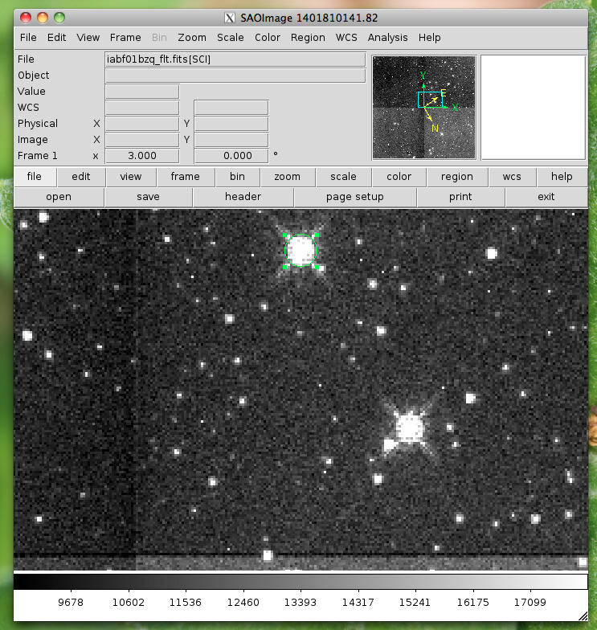
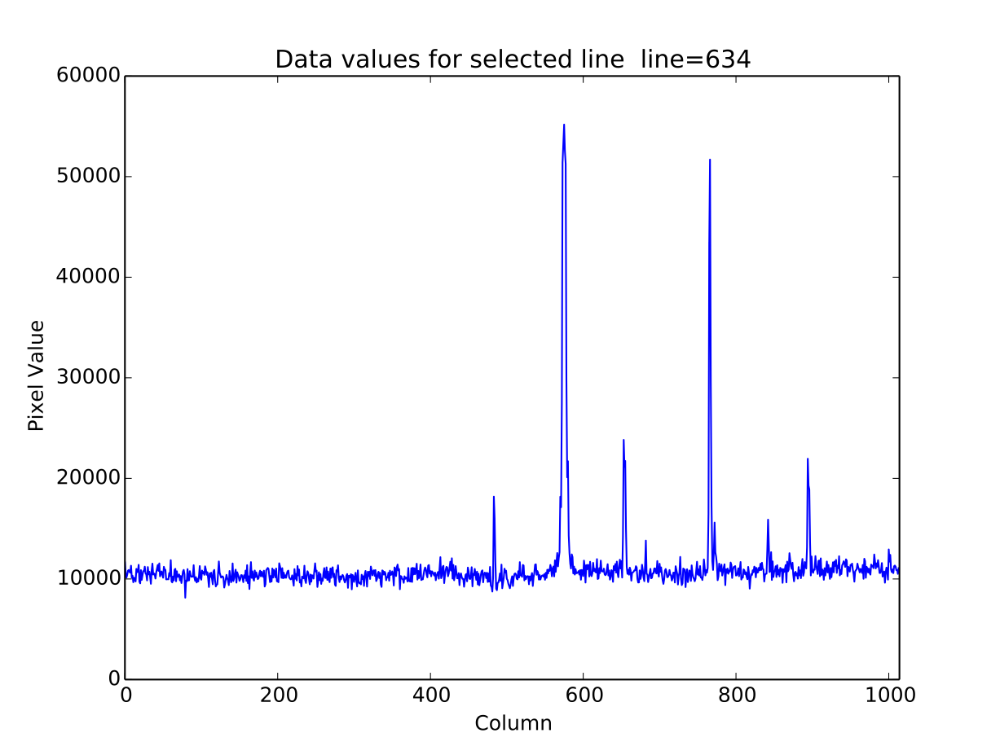
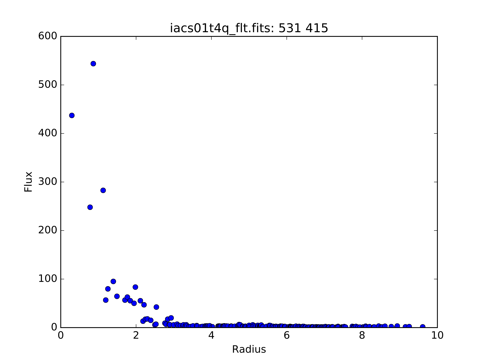
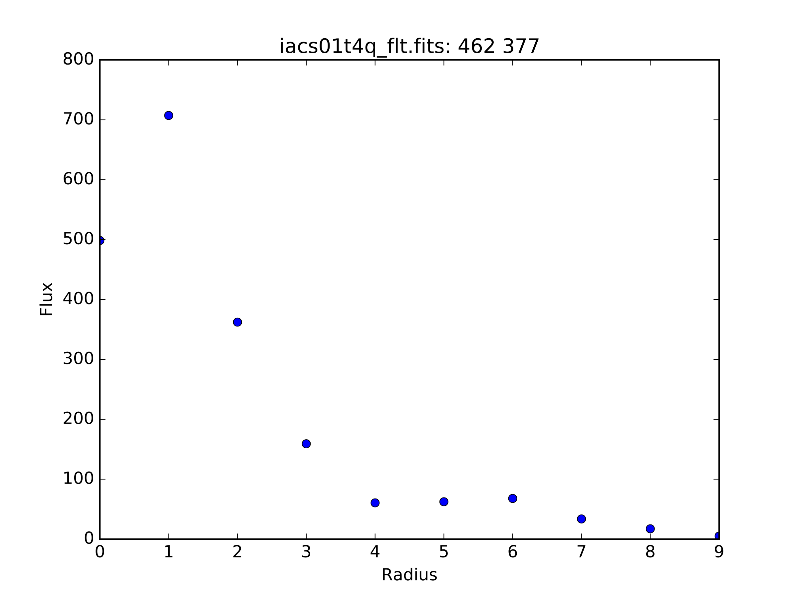
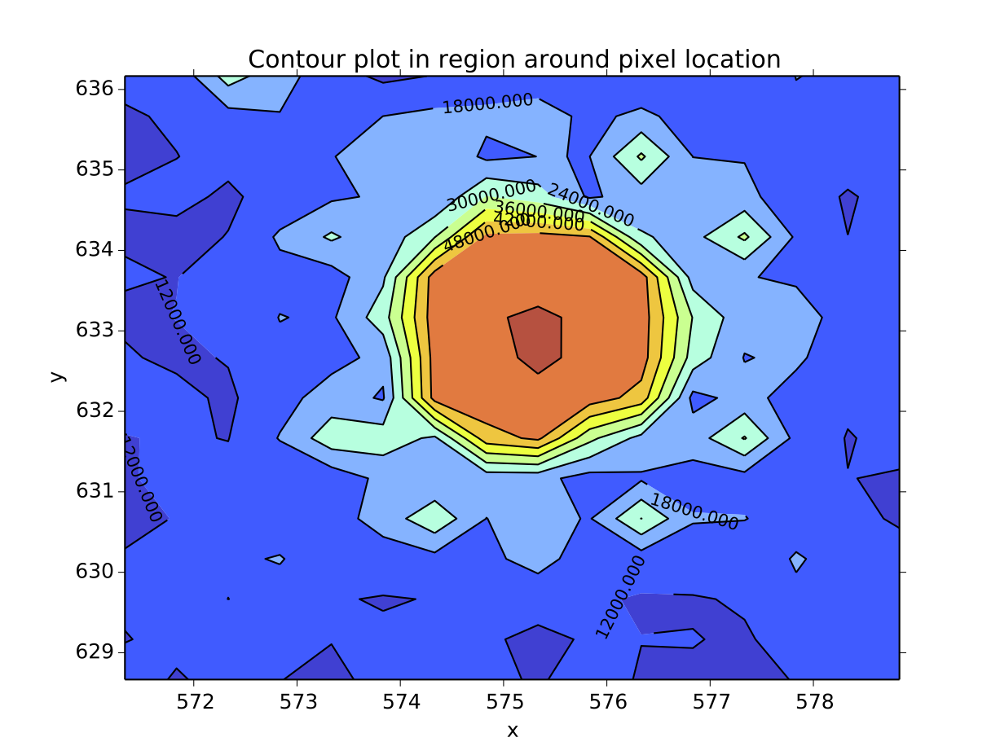
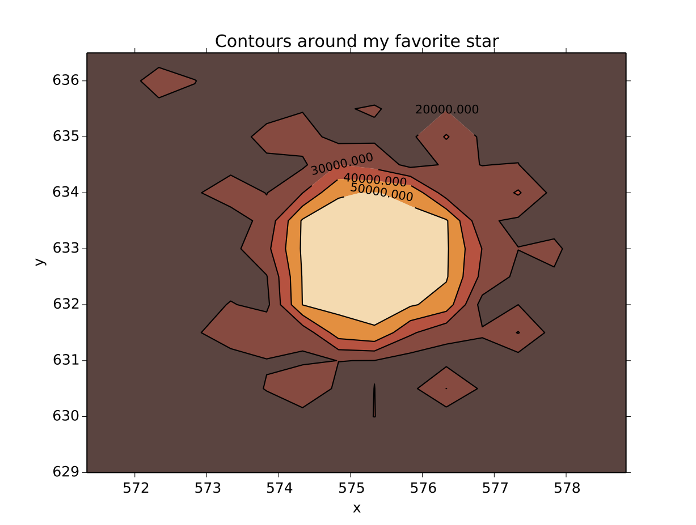
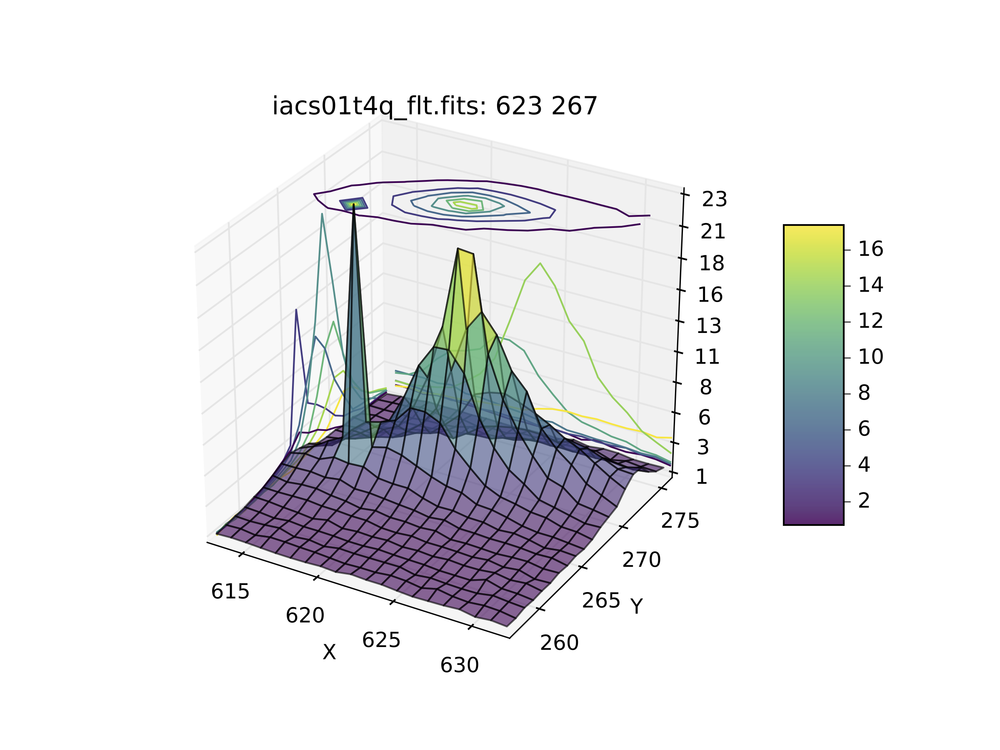
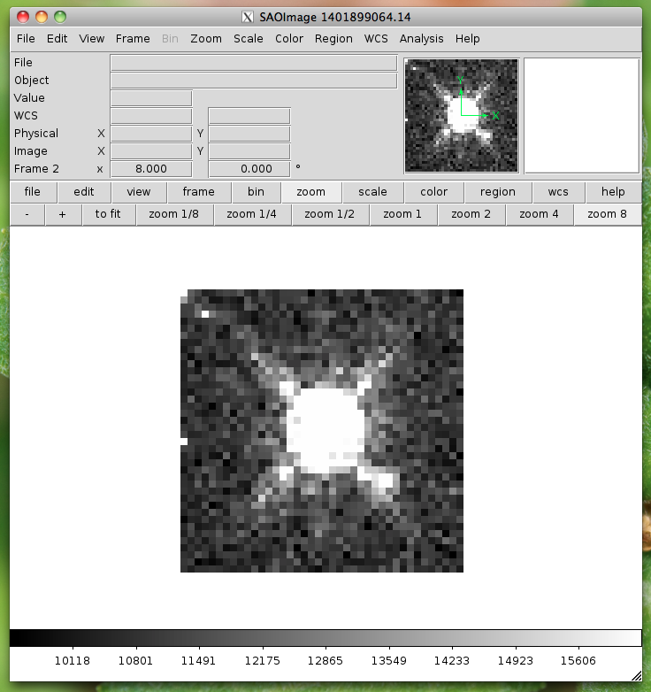
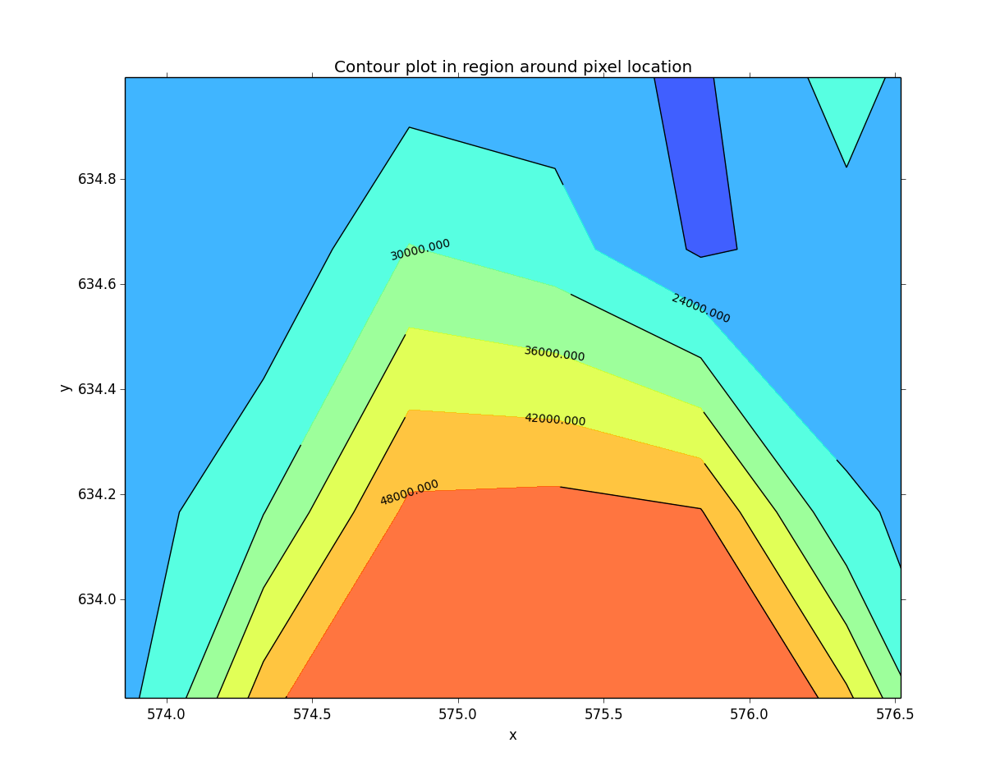

===================
The imexam() method
===================
This is the main method which allows live interaction with the image display when you are using  viewing your image or data array.  If you execute imexam() while using the Ginga widget, it will display the available options, however they are always available for use via keystroke and are event-driven (using the same keys described below). In order to turn the key-press capture on and off while you have your mouse in the Ginga widget press the "i" key. Either the "i" or "q" key can be used to quit out the exam.

**imexam** ():
    access realtime imexamine functions through the keyboard and mouse

**Current recognized keys available during imexam are:** ::

    2	Make the next plot in a new window
    a	Aperture sum, with radius region_size
    b	Return the 2D gauss fit center of the object
    c	Return column plot
    e	Return a contour plot in a region around the cursor
    g	Return curve of growth plot
    h	Return a histogram in the region around the cursor
    j	1D [Gaussian1D default] line fit
    k	1D [Gaussian1D default] column fit
    l	Return line plot
    m	Square region stats, in [region_size],default is median
    r	Return the radial profile plot
    s	Save current figure to disk as [plot_name]
    t	Make a fits image cutout using pointer location
    w	Display a surface plot around the cursor location
    x	Return x,y,value of pixel
    y	Return x,y,value of pixel

     aimexam(): return a dict of current parameters for aperture photometery

     cimexam(): return dict of current parameters for column plots

     eimexam(): return dict of current parameters for contour plots

     himexam(): return dict current parameters for histogram plots

     jimexam(): return dict current parameters for 1D line plots

     kimexam(): return dict of current parameters for 1D column plots

     limexam(): return dict of current parameters for  line plots

     gimexam(): return dict of current parameters for curve of growth plots

     rimexam(): return the dict of current parameters for radial profile plots

     wimexam(): return dict of current parameters for surface plots

     mimexam(): return dict of current parameters for area statistics

     timexam(): return a dict of the current parameters for image cutouts

.. note:: Some of the plots accept a marker type, any valid Matplotlib marker may be specified. See this page for the full list: http://matplotlib.org/api/markers_api.html#module-matplotlib.markers

The ``imexam`` key dictionary is stored inside the user object as  <object_name>.exam.imexam_option_funcs{}. Each key in the dictionary is the keyboard key to recognize from the user, it's associated value is a tuple which contains the name of the function to call and a description of what that function does. "q" is always assumed to be the returned key when the user wishes to quit interaction with the window. Users may change the default settings for each of the imexamine recognized keys by editing the associated dictionary. You can edit it directly, by accessing each of the values by their keyname and then reset mydict to values you prefer. You can also create a new dictionary of function which maps to your own

You can customize the plotting parameters using ``set_plot_pars``. In the following example, I'm setting three of the parameters for the contour map, whose imexam key is "e"::

    #customize the plotting parameters (or any function in the imexam loop)
    a.set_plot_pars('e','title','This is my favorite galaxy')
    a.set_plot_pars('e','ncontours',4)
    a.set_plot_pars('e','cmap','YlOrRd') #see http://matplotlib.org/users/colormaps.html

where the full dictionary of available values can be found using the ``eimexam()`` function described above.::

    In [1]: a.eimexam()
    Out[2]:
    {'ceiling': [None, 'Maximum value to be contoured'],
     'cmap': ['RdBu', 'Colormap (matplotlib style) for image'],
     'floor': [None, 'Minimum value to be contoured'],
     'function': ['contour'],
     'label': [True, 'Label major contours with their values? [bool]'],
     'linestyle': ['--', 'matplotlib linestyle'],
     'ncolumns': [15, 'Number of columns'],
     'ncontours': [8, 'Number of contours to be drawn'],
     'nlines': [15, 'Number of lines'],
     'title': [None, 'Title of the plot'],
     'xlabel': ['x', 'The string for the xaxis label'],
     'ylabel': ['y', 'The string for the yaxis label']}

Users may also add their own ``imexam`` keys and associated functions by registering them with the register(user_funct=dict()) method. The new binding will be added to the dictionary of imexamine functions as long as the key is unique. The new functions do not have to have default dictionaries association with them, but users are free to create them.

For all the examples below I will use a session similar to the following example::

    #This will default to DS9 for the viewer

    import imexam
    viewer=imexam.connect()
    viewer.load_fits('iabf01bzq_flt.fits')
    viewer.scale()
    viewer.panto_image(576,633)
    viewer.zoom(3)

This will use Ginga (instead of the default DS9) for the viewer::

    #Use Ginga for the image viewer, make sure it is installed

    import imexam
    viewer=imexam.connect(viewer='ginga')
    viewer.load_fits('iabf01bzq_flt.fits')
    viewer.scale()
    viewer.panto_image(576,633)
    viewer.zoom(3)

.. image:: ../_static/imexam_command_example_ginga.png
    :height: 400
    :width: 400
    :alt: Data used for imexam command examples

Circular Apterture Photometry
-----------------------------

Aperture photometry is performed when you press the "a" key. It is implemented using the `photutils`_ python package, an affiliated package of astropy that is still in development.

Currently, the calculation which is performed is similar to the "," or "a" IRAF imexamine keys. It is circular aperture photometry, centered on the mouse location at the time the key is pressed, with a background annulus subtraction for the sky. The radius of the aperture is set with the region_size keyword (default to 5 pixels). The annulus size is also set to the width, and taken a distance of skyrad pixels from the center. The pixels used to calculate the enclosed flux are those whose centers fall inside the radius distance, in the same way that IRAF imexamine computes the flux.

These are the default parameters for aperture photometry. They live in a dictionary in the exam object::

    The direct access:

    viewer.exam.aperphot_pars= {"function":["aperphot",],
                    "center":[True,"Center the object location using a Gaussian2D fit"],
                    "width":[5,"Width of sky annulus in pixels"],
                    "subsky":[True,"Subtract a sky background?"],
                    "skyrad":[15,"Distance to start sky annulus is pixels"],
                    "radius":[5,"Radius of aperture for star flux"],
                    "zmag":[25.,"zeropoint for the magnitude calculation"],
                    }
    Using the convenience function:

    In [1]: a.aimexam()
    Out[2]:
    {'center': [True, 'Center the object location using a 2d gaussian fit'],
    'function': ['aper_phot'],
     'radius': [5, 'Radius of aperture for star flux'],
     'skyrad': [15, 'Distance to start sky annulus is pixels'],
     'subsky': [True, 'Subtract a sky background?'],
     'width': [5, 'Width of sky annulus in pixels'],
     'zmag': [25.0, 'zeropoint for the magnitude calculation']}

In order to change the width of the photometry aperture around the object you would do this ::

    viewer.set_plot_pars('a',"radius",10)

This is what the return looks like when you do photometry, where I've asked for photometry from the star circled in green above::

    viewer.imexam()

    xc=576.855763	yc=634.911425
    x              y              radius         flux           mag(zpt=25.00) sky            fwhm
    576.86         634.91         10             2191284.53     9.15           10998.89       5.58

xc = xcenter, yc=ycenter; these were found using a Gaussian2D fit centered on the pixel location of the mouse. You can turn the fit off by setting the "center" parameter to "False".

Gaussian1D, Moffat1D, MexicanHat1D profiles
-------------------------------------------
If you press the "j" or "k" keys, a 1D profile is fit to the data in either the line or column of the current pointer location. An option to use a Polynomial1D fit is also available, although not something of use for looking at stellar profiles. A plot of both the data and the fit + parameters is displayed. If the centering option is True, then the center of the flux is computed by fitting a 2d Gaussian to the data. ::

    line_fit_pars={"function":["line_fit",],
                   "func":["gaussian","function for fitting [see available]"],
                   "title":["Fit 1D line plot","Title of the plot"],
                   "xlabel":["Line","The string for the xaxis label"],
                   "ylabel":["Flux","The string for the yaxis label"],
                   "background":[False,"Solve for background? [bool]"],
                   "width":[10.0,"Background  width in pixels"],
                   "xorder":[0,"Background terms to fit, 0=median"],
                   "rplot":[20.,"Plotting radius in pixels"],
                   "pointmode":[True,"plot points instead of lines? [bool]"],
                   "logx":[False,"log scale x-axis?"],
                   "logy":[False,"log scale y-axis?"],
                   "center":[True,"Recenter around the local max"],
                   }

The column fit parameters are similar::

    column_fit_pars={"function":["column_fit",],
                     "func":["Gaussian1D","function for fitting [see available]"],
                     "title":["Fit 1D column plot","Title of the plot"],
                     "xlabel":["Column","The string for the xaxis label"],
                     "ylabel":["Flux","The string for the yaxis label"],
                     "background":[False,"Solve for background? [bool]"],
                     "width":[10.0,"Background  width in pixels"],
                     "xorder":[0,"Background terms to fit, 0=median"],
                     "rplot":[20.,"Plotting radius in pixels"],
                     "pointmode":[True,"plot points instead of lines? [bool]"],
                     "logx":[False,"log scale x-axis?"],
                     "logy":[False,"log scale y-axis?"],
                     "center":[True,"Recenter around the local max"],
                     }

This is the resulting line fit:

.. image:: ../_static/fit_line.png
    :height: 400
    :width: 600
    :alt: Plot of Gaussian1D profile fit to data

and the corresponding column fit:

.. image:: ../_static/fit_column.png
    :height: 400
    :width: 600
    :alt: Plot of Gaussian1D profile fit to data

Square region statistics
--------------------------
If you press the "m" key, the  pixel values around the pointer location are calculated inside a box which has a side equal to the region_size, defaulted to 5 pixels, and using the statistical function chosen.

The user can map the function to any reasonable numpy function, it's set to numpy.median by default::

    report_stat_pars= {"function":["report_stat",],
                        "stat":["median","which numpy stat to return [median,min,max...must map to numpy func]"],
                        "region_size":[5,"region size in pixels to use"],
                    }

    [573:578,629:634] median: 50632.000000

You can change the statistic reported by changing the "stat" parameter::

    viewer.set_plot_pars('m',"stat","max")

    [572:577,629:634] amax: 55271.000000

You can make a quick comparison of the max reported above with the line fit graph in the 1D gaussian profile example.

You can also choose to use the `scipy.stats.describe`_ function if you have scipy installed by changing the stat to "describe"; this will report the combined stats for the region:::

    pressed: m, report_stat
    [551:556,653:658] describe:
    nobs: 25
    minamx: (0.51326549, 0.85604763)
    mean 0.6851165890693665
    variance: 0.00780616095289588
    skew: 0.05719175934791565
    kurtosis: -0.47930471400886976

Pixel Coordinates and Value
---------------------------
Hitting the 'x' or 'y' will return the x,y coordinate and pixel value under the mouse pointer.::

    576.0 633.66667  55271.0

When not inside the imexam() loop, you can also set the location of the pointer using
the wcs or pixel location you wish to view.

Line or Column plots
--------------------
Pressing the "l" or "c" keys will display a plot of the points through either the line or column closest to the cursor location.

.. image:: ../_static/column_plot.png
    :height: 400
    :width: 600
    :alt: Column plot

Radial Profile Plot
-------------------

Pressing the "r" key displays a radial profile plot for the flux around the current pointer location. If centering is on, the center is computed close to the star using a Gaussian2D fit. The default plot uses every pixel

The available parameters are ::

            radial_profile_pars = {"function": ["radial_profile_plot", ],
                        "title": ["Radial Profile", "Title of the plot"],
                        "xlabel": ["Radius", "The string for the xaxis label"],
                        "ylabel": ["Summed Pixel Value", "The string for the yaxis label"],
                        'pixels': [True, 'Plot all pixels at each radius? (False bins the data)']
                        "fitplot": [False,"Overplot profile fit?"],
                        "fittype":["Gaussian1D","Profile type to fit (gaussian)"],
                        "center": [True, "Solve for center using 2d Gaussian? [bool]"],
                        "background": [True, "Subtract background? [bool]"],
                        "skyrad": [10., "Background inner radius in pixels, from center of object"],
                        "width": [5., "Background annulus width in pixels"],
                        "magzero": [25., "magnitude zero point"],
                        "rplot": [8., "Plotting radius in pixels"],
                        "pointmode": [True, "plot points instead of lines? [bool]"],
                        "marker": ["o", "The marker character to use, matplotlib style"],
                        "minflux": [0., "only measure flux above this value"],
                        "getdata": [True, "return the plotted data values"]
                        }

Radial profile plot for all pixels around the location:

Radial profile plot for all pixels, binned to integer radii:

Curve of Growth plot
--------------------
Pressing the "r" key displays a curve of growth for the flux around the current pointer location in successively larger radii.
If centering is on, the center is computed close to the star using a 2d gaussian fit.

The available parameters are ::

    curve_of_growth_pars={"function":["curve_of_growth_plot",],
                          "title":["Curve of Growth","Title of the plot"],
                          "xlabel":["radius","The string for the xaxis label"],
                          "ylabel":["Flux","The string for the yaxis label"],
                          "center":[True,"Solve for center using 2d Gaussian? [bool]"],
                          "background":[True,"Fit and subtract background? [bool]"],
                          "buffer":[25.,"Background inner radius in pixels,from center of star"],
                          "width":[5.,"Background annulus width in pixels"],
                          "magzero":[25.,"magnitude zero point"],
                          "rplot":[8.,"Plotting radius in pixels"],
                          "pointmode":[True,"plot points instead of lines? [bool]"],
                          "marker":["o","The marker character to use, matplotlib style"],
                          "logx":[False,"log scale x-axis?"],
                          "logy":[False,"log scale y-axis?"],
                          "minflux":[0., "only measure flux above this value"],
                          }

.. image:: ../_static/curve_of_growth.png
    :height: 400
    :width: 600
    :alt: Curve of growth  plot around star

Returned to the screen is the data information from the plot, the (x,y) location of the center, followed by the radius and corresponding flux which was measured::

    viewer.set_plot_pars('g',"rplot",25)  #set the default radius larger

    xc=577.242311	yc=634.578361

    at (x,y)=577,634
    radii:[ 1  2  3  4  5  6  7  8  9 10 11 12 13 14 15 16 17 18 19 20 21 22 23 24 25]
    flux:[131192.03694247041, 489485.48536408512, 911376.50226695999, 1301726.7189847208, 1547865.8684735354, 1777547.7859571185, 1940955.1267221647, 2047700.7156964755, 2165971.1952809561, 2280391.5901085823, 2376090.3555588746, 2458370.0006153183, 2523384.2243051622, 2575208.3657517368, 2609309.6524876151, 2643279.3635597304, 2672443.1546003688, 2687659.5178374872, 2702128.5513395425, 2709501.1520242952, 2720134.8632924128, 2734777.3482598308, 2746056.5231984705, 2770352.0070485324, 2781242.3299104609]

Histogram Plots
---------------

Pressing the "h" key will display a histogram of pixel values around the pixel location under the mouse pointer. ::

    histogram_pars={"function":["histogram",],
                    "title":["Histogram","Title of the plot"],
                    "xlabel":["Flux (bin)","The string for the xaxis label"],
                    "ylabel":["Count","The string for the yaxis label"],
                    "ncolumns":[21,"Number of columns"],
                    "nlines":[21,"Number of lines"],
                    "nbins":[100,"Number of bins"],
                    "z1":[None,"Minimum histogram intensity"],
                    "z2":[100,"Maximum histogram intensity"],
                    "pointmode":[True,"plot points instead of lines? [bool]"],
                    "marker":["o","The marker character to use, matplotlib style"],
                    "logx":[False,"log scale x-axis?"],
                    "logy":[False,"log scale y-axis?"],
                    }

.. image:: ../_static/histogram_plot.png
    :height: 400
    :width: 600
    :alt: histogram plot

Contour Plots
-------------

Pressing the "e" key will display  a contour plot around the clicked pixel location. ::

    contour_pars={"function":["contour",],
                       "title":["Contour plot in region around pixel location","Title of the plot"],
                       "xlabel":["x","The string for the xaxis label"],
                       "ylabel":["y","The string for the yaxis label"],
                       "ncolumns":[15,"Number of columns"],
                       "nlines":[15,"Number of lines"],
                       "floor":[None,"Minimum value to be contoured"],
                       "ceiling":[None,"Maximum value to be contoured"],
                       "ncontours":[8,"Number of contours to be drawn"],
                       "linestyle":["--","matplotlib linestyle"],
                       "label":[True,"Label major contours with their values? [bool]"],
                       "cmap":["viridis","Colormap (matplotlib style) for image"],
                       }

Here's what it looks like if we change some of the default parameters::

    viewer.set_plot_pars('e', "cmap", "gist_heat")
    viewer.set_plot_pars('e', "title", "Contours around my favorite star")
    viewer.set_plot_pars('e', "ncontours", 4)
    viewer.set_plot_pars('e', "floor", 0)

.. note:: You can use any of the matplotlib standard cmaps, see here for more information: http://matplotlib.org/api/pyplot_summary.html?highlight=colormaps#matplotlib.pyplot.colormaps

Surface Plots
-------------

Pressing the "s" key will display a 3D surface plot of pixel values around the mouse pointer location with the default parameters::

    surface_pars = {"function": ["surface", ],
                    "title": [None, "Title of the plot"],
                    "xlabel": ["X", "The string for the xaxis label"],
                    "ylabel": ["Y", "The string for the yaxis label"],
                    "zlabel": [None, "Label for zaxis"],
                    "ncolumns": [10, "Number of columns"],
                    "nlines": [10, "Number of lines"],
                    "azim": [None, "azimuthal viewing angle in degrees"],
                    "floor": [None, "Minimum value to be contoured"],
                    "ceiling": [None, "Maximum value to be contoured"],
                    "stride": [1, "step size, higher vals will have less contour"],
                    "cmap": ["viridis", "colormap (matplotlib) for display"],
                    "fancy": [True, "This aint your grandpas iraf"],
                    }

Or, with the contours turned off and a different title:

.. image:: ../_static/fancy_surface.png
    :height: 600
    :width: 800
    :alt: fancy surface plot

Cutout a Simple FITS Image
---------------------------

.. image:: ../_static/user_func_1.png
    :height: 400
    :width: 600
    :alt: user function 1

Okay, I went to the star I like and pressed "t". Let's verify that we got what we wanted, it should be a cutout centered on the star that we've used in all the examples here::

    image=fits.open('cutout_575.0_633.07fdinJ.fits')
    viewer.frame(2)
    viewer.view(image)

And the resulting frame view?

Sweet. Because this is a often used function I've made it a part of the standard
selection set. If you wish to use the astropy 2D cutout method, you can create
your own function which will also pass in the WCS object for the data so that
the cutout retains it's WCS information.

User Specified functions
------------------------
Users may code their own functions and bind them to keys by registering them with the ``imexam`` dictionary through the register method that lives in the exam object. The new binding will be added to the dictionary of imexamine functions as long as the key is unique. The new functions do not have to have default dictionaries associated with them. The binding is only good for the current object, new instantiations of ``imexam.connect()`` will not have the new function unless the user specifically registers them.

Here's all the code for a function which saves the cursor location to a file called 'test.list' when the user presses the 'p' key:

::

    def save_to_file(self,x,y,data):
        """Save the cursor location only to a file"""
        if data is None:
          data = self._data
        with open('test.list','a') as ofile:
          ofile.write("{0}\t{1}\n".format(x,y))
        print("Saved star to ",'test.list')

Now, import that into your python session, file, or here I'll just copy paste the definition to the session. This is an important step because the function reference is what you are going to send to the registration method. The registration method wants you to supply a dictionary which contains the key you want to assign that function to during the imexam() loop, and a tuple with the function name and description::

    my_dict = {'p': (save_to_file, 'Save cursor location to file')}

    viewer.exam.register(my_dict)
    User function: save_to_file added to imexam options with key p

Okay, so let's try out our new function! We should be able to see it in the list of available options.

::

        In [18]: a.imexam()

        Press 'q' to quit

        2	Make the next plot in a new window
        a	Aperture sum, with radius region_size
        b	Return the 2D gauss fit center of the object
        c	Return column plot
        e	Return a contour plot in a region around the cursor
        g	Return curve of growth plot
        h	Return a histogram in the region around the cursor
        j	1D [Gaussian1D default] line fit
        k	1D [Gaussian1D default] column fit
        l	Return line plot
        m	Square region stats, in [region_size],default is median
        p	Save cursor location to file
        r	Return the radial profile plot
        s	Save current figure to disk as [plot_name]
        t	Make a fits image cutout using pointer location
        w	Display a surface plot around the cursor location
        x	Return x,y,value of pixel
        y	Return x,y,value of pixel

        Current image /Users/sosey/test_images/iacs01t4q_flt.fits
        pressed: p, save_to_file
        Saved star to  test.list

        In [19]: !more test.list
        463.0   376.75

Plot Multiple Windows
---------------------

During a single viewer.imexam() session, you can choose to send your plots to multiple windows. Each window may only be used once, but if you would like to plot multiple things to compare, either the same plots for multiple  objects or multiple types of plots for a single object, you can press the "2"  key. This will save the current plotting window on your desktop and send the next plot to a new window.Here's what that might look like::

    #run aperture photometry("a"):

    xc=576.522433	yc=634.578085
    x              y              radius         flux           mag(zpt=25.00) sky            fwhm
    576.52         634.58         5              1560462.68     9.52           10996.52       5.58

    #make a column plot ("c")

    #direct to a new window and make a contour plot ("e")
    Plots now directed towards imexam2

    #direct to a new window and make a curve of growth ("r")
    Plots now directed towards imexam3

    #the resulting curve of growth information on the screen
    xc=576.855763	yc=634.911425

    at (x,y)=576,634
    radii:[1 2 3 4 5 6 7 8]
    flux:[134294.19631173008, 521208.13904411002, 1017231.0442446949, 1297592.7076232315, 1568629.6771239617, 1813434.3810552177, 1935335.7549474821, 2049080.846300941]

This is what the workspace could look like with DS9 as the viewer:

.. image:: ../_static/multiple_plots.png
    :height: 650
    :width: 800
    :alt: multiple plots in DS9 with imexam

As an aside, you can use the GUI tools on the bottom of the plot windows to move around the displayed data, such as zooming in and out, as shown below for the contour plot, which was also saved using the GUI save button:

.. _photutils: http://github.com/astropy/photutils/
.. _scipy.stats.describe:  http://docs.scipy.org/doc/scipy/reference/generated/scipy.stats.describe.html
