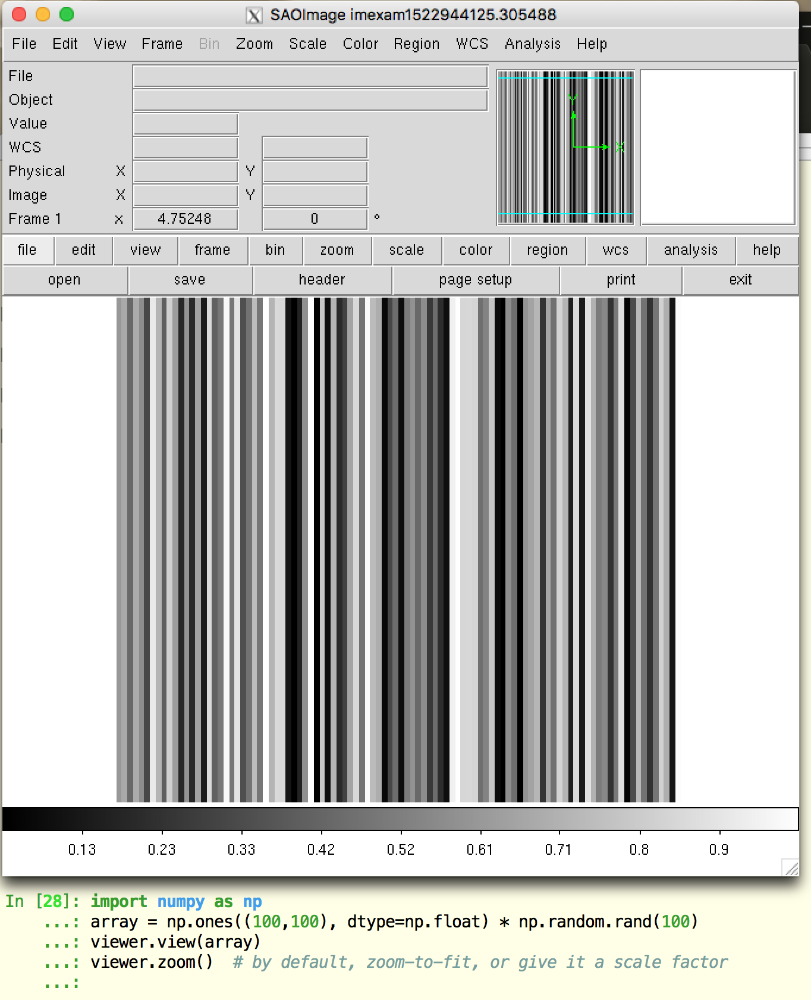
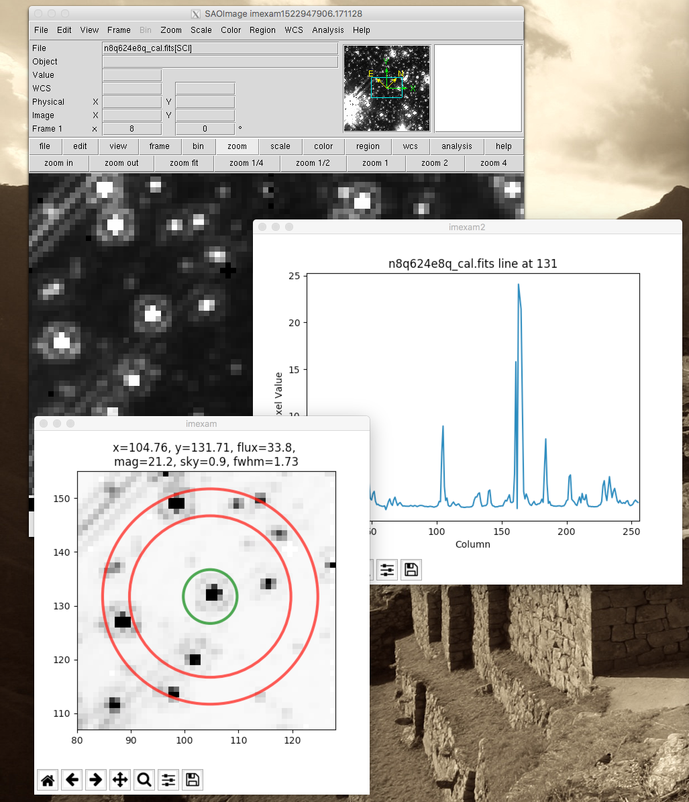
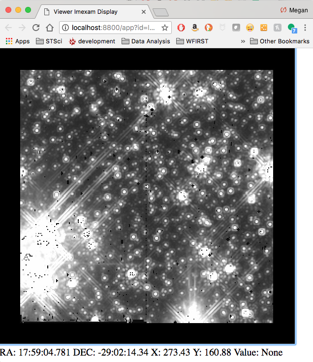

==================
Simple Walkthrough
==================

This is intended as a basic example of using the imexam package as a quicklook 
for image examination. If you are new to python or to the python version of imexam,
start here to get your feet wet.

First you need to import the package
::

    import imexam

Usage with D9 (the current default viewer)
------------------------------------------
Start up a ``DS9`` window (DS9 is the default viewer):

* a new ``DS9`` window will be opened
* open a fits image
* scale the image using zscale()::

    viewer=imexam.connect()  # startup a new DS9 window
    viewer.load_fits('iacs01t4q_flt.fits')  # load a fits image into it
    viewer.scale()  # run default zscaling on the image

.. image:: ../_static/simple_ds9_open.png
        :height: 600
        :width: 400
        :alt: imexam with DS9 window and loaded fits image

If you already have a DS9 gui running, you can ask for a list of available windows:

::

    # This will display if you've used the default command above and have no other DS9 windows open
    In [1]: imexam.list_active_ds9()
    DS9 imexam1522943947.288667 gs a825364:62436 sosey
    Out[2]: {'a825364:62436': ('imexam1522943947.288667', 'sosey', 'DS9', 'gs')}

    ## imexam puts its own unique name on the window

    # open a window in another process from the shell
    # you should see it use the default name, 'ds9'
    In [3]: !ds9&
    In [4]: imexam.list_active_ds9()
    Out[7]: 
    {'a825364:62436': ('imexam1522943947.288667', 'sosey', 'DS9', 'gs'),
     'a825364:62459': ('ds9', 'sosey', 'DS9', 'gs')}

You can attach to a current ``DS9`` window by specifying its unique name,
this is the first name listed in the dictionary item values tuple:
::

    viewer1 = imexam.connect('ds9')

If you haven't given your windows unique names using the ``-title <name>`` option from the commandline, then you must use the ip:port address. This address is also the key that is
returned in the dictionary of active DS9 windows. In order to attached to the window
we stared in the shell, use : `a825364:62459`

    viewer1 = imexam.connect('a825364:62459')

Load a fits image into the new DS9 window:

    viewer1.load_fits('n8q624e8q_cal.fits')

You may have noticed that the information from `list_active_ds9()` is returned in a python dictionary structure, this is to enable quick cycling or picking of available DS9 windows
by asking for the keys in the dictionary. This following is just for instruction
purposes, the code below asks for the list of windows and then successively
displays the same image to each one::

    ds9_windows = imexam.list_active_ds9()
    for window in ds9_windows:
        temp=imexam.connect(window)
        temp.load_fits('n8q624e8q_cal.fits')

It's also possible to load a FITS image object that you already have opened in your
python session, if no extension is given, then the first IMAGE exension that is found
will be loaded as a numpy array::

    from astropy.io import fits
    image = fits.open('n8q624e8q_cal.fits')
    viewer1.load_fits(image)

Using `get_viewer_info()` returns information about what is contained
inside the DS9 window. There could be many uses for the returned
dictionary, here I'm just listing the information to show you 
how the display of the FITS file versus the FITS object changes
the information that `imexam` stores::

    In [23]: viewer1.get_viewer_info()
    Out[23]: 
    {'1': {'extname': 'SCI',
      'extver': 1,
      'filename': '/Users/sosey/test_images/n8q624e8q_cal.fits',
      'iscube': False,
      'mef': True,
      'naxis': 0,
      'numaxis': 2,
      'user_array': None}}

      # Above, you can see there is only 1 frame, named 1, that
      # contains a multi-extension fits file

    In [24]: from astropy.io import fits
    In [25]: image = fits.open('n8q624e8q_cal.fits')
    In [26]: viewer1.load_fits(image)
    In [27]:  viewer1.get_viewer_info()
    Out[27]: 
    {'1': {'extname': None,
      'extver': None,
      'filename': None,
      'iscube': False,
      'mef': False,
      'naxis': 0,
      'numaxis': 2,
      'user_array': array([[ 0.        ,  0.        ,  0.73420113, ...,  2.29928851,
               1.13779497,  0.40814143],
             [ 0.        ,  0.76415622,  0.        , ...,  2.02307796,
               1.07565212,  0.44265628],
             [ 0.        ,  0.76297635,  0.65969932, ...,  0.61184824,
               0.48248726,  0.41064522],
             ..., 
             [ 0.5144701 ,  0.38698068,  0.31468284, ...,  1.57044649,
               0.42518842,  0.50868863],
             [ 0.44805121,  0.34715804,  0.33939072, ...,  0.67747742,
               0.46475834,  0.51104462],
             [ 0.53063494,  0.54570055,  0.53724855, ...,  0.4361479 ,
               0.58057427,  0.45152891]], dtype=float32)}}

      # Above you can see that there is only 1 frame, but it contains 
      # a numpy array and no filename reference.

You can also load a numpy array directly, we'll create an example array 
and display it to our viewer::

    import numpy as np
    array = np.ones((100,100), dtype=np.float) * np.random.rand(100)
    viewer.view(array)
    viewer.zoom()  # by default, zoom-to-fit, or give it a scale factor

Now lets use `imexam()` to create a couple plots::

    viewer.load_fits('n8q624e8q_cal.fits')
    viewer.imexam()

The available key mappings should be printed to your terminal::

    In [7]: viewer.imexam()

    Press 'q' to quit

    2 Make the next plot in a new window
    a Aperture sum, with radius region_size 
    b Return the 2D gauss fit center of the object
    c Return column plot
    d Return the Center of Mass fit center of the object
    e Return a contour plot in a region around the cursor
    g Return curve of growth plot
    h Return a histogram in the region around the cursor
    j 1D [Gaussian1D default] line fit 
    k 1D [Gaussian1D default] column fit
    l Return line plot
    m Square region stats, in [region_size],default is median
    r Return the radial profile plot
    s Save current figure to disk as [plot_name]
    t Make a fits image cutout using pointer location
    w Display a surface plot around the cursor location
    x Return x,y,value of pixel
    y Return x,y,value of pixel

Look at the window below, I've started the imexam loop
and then pressed the 'a' key to create an aperture photometry
plot (which also printed information about the photometry to 
the terminal), then I pressed the '2' key in order to keep the
current plot open and direct the next plot to a new window, 
where I've asked for a line plot of the same star, using the 'l' key.

You should see the printed information in your terminal::

    Current image /Users/sosey/test_images/n8q624e8q_cal.fits
    xc=104.757598   yc=131.706727
    x              y              radius         flux           mag(zpt=25.00) sky/pix        fwhm(pix)
    104.76         131.71         5              33.84          21.18          0.87           1.73
    Plots now directed towards imexam2
    Line at 104.75 131.625

Users may change the default settings for each of the imexamine recognized keys by
editing the associated dictionary. You can edit it directly, by accessing each of
the values by their keyname and then reset mydict to values you prefer. You can 
also create a new dictionary of functions which map to your own analysis functions.

However, you can access the same dictionary and customize the plotting parameters using ``set_plot_pars``. In the following example, I'm setting three of the parameters for the contour map, whose imexam key is "e"::

    #customize the plotting parameters (or any function in the imexam loop)
    viewer.set_plot_pars('e','title','This is my favorite galaxy')
    viewer.set_plot_pars('e','ncontours',4)
    viewer.set_plot_pars('e','cmap','YlOrRd') #see http://matplotlib.org/users/colormaps.html

where the full dictionary of available values can be found using the ``eimexam()`` function described above.::

    In [1]: viewer.eimexam()
    Out[2]:
    {'ceiling': [None, 'Maximum value to be contoured'],
     'cmap': ['RdBu', 'Colormap (matplotlib style) for image'],
     'floor': [None, 'Minimum value to be contoured'],
     'function': ['contour'],
     'label': [True, 'Label major contours with their values? [bool]'],
     'linestyle': ['--', 'matplotlib linestyle'],
     'ncolumns': [15, 'Number of columns'],
     'ncontours': [8, 'Number of contours to be drawn'],
     'nlines': [15, 'Number of lines'],
     'title': [None, 'Title of the plot'],
     'xlabel': ['x', 'The string for the xaxis label'],
     'ylabel': ['y', 'The string for the yaxis label']}

Users may also add their own ``imexam`` keys and associated functions by registering them with the register(user_funct=dict()) method. The new binding will be added to the dictionary of imexamine functions as long as the key is unique. The new functions do not have to have default dictionaries association with them, but users are free to create them.

Usage with Ginga viewer
-----------------------

Start up a ginga window using the HTML5 backend and display an image. Make sure that you have installed the most recent version of ginga, ``imexam`` may return an error that the viewer cannot be found otherwise.::

    # since we've already used the viewer object
    # to point to a DS9 window in the example
    # above, we'll first cleanly close that down
    viewer.close()

    # now connect to a ginga window
    viewer=imexam.connect(viewer='ginga')
    viewer.load_fits('n8q624e8q_cal.fits')

.. note:: All commands after your chosen viewer is opened are the same. Each viewer may also have it's own set of commands which you can additionally use.

Scale the image to the default scaling, which is a zscale algorithm, but the viewers other scaling options are also available::

    viewer.scale()
    viewer.scale('asinh')  # <-- uses asinh

.. note:: When using the Ginga interface, the `imexam` plotting and analysis functions are used by pressing the 'i' key to enter imexam mode. Inside this mode the key mappings are as listed by `imexam`, outside of this mode (pressing 'q') the Ginga key mappings are in effect.

When you are using the HTML5 Ginga viewer, the `close()` method will stop the HTTP server, but you must close the window manually. 

    In [34]: viewer.close()
    Stopped http server

