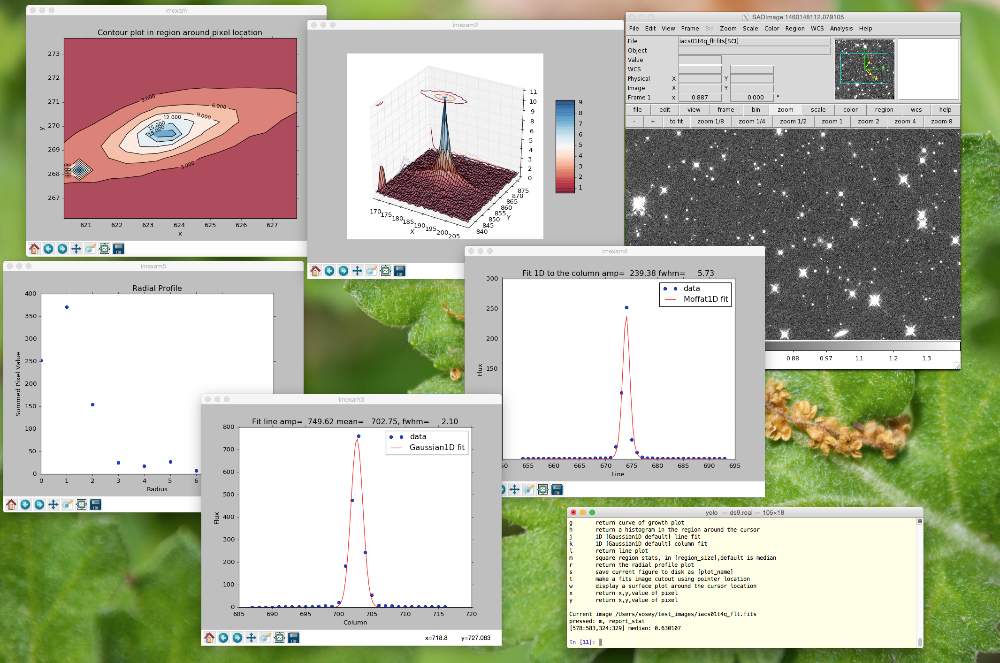
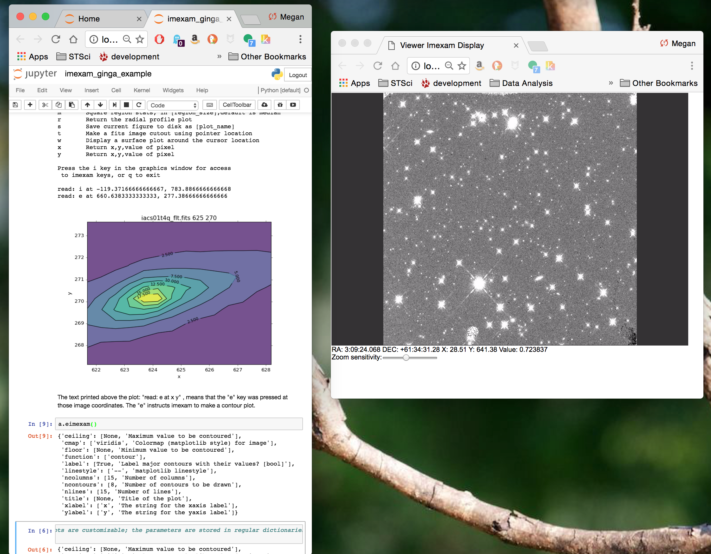

``imexam`` is an affiliated package of AstroPy. It was designed to be a lightweight library which enables users to explore data using common methods which are consistant across viewers. It can be used from a command line interface, through a Jupyter notebook or through a Jupyter console. It can be used with multiple viewers, such as DS9 or Ginga, or without a viewer as a simple library to make plots and grab quick photometry information. The above image is an example desktop interfacing with DS9. Below, is another example desktop using the Jupyter notebook and the Ginga HTML5 viewer.

The power of this python tool is that it is essentially a library of plotting
and analysis routines which can be directed towards any viewer. It attempts to
standardize the interface into these functions so that no matter
what viewer is in use the calls and results are the same.  It can also be used
without connecting to any viewer since the calls take only data and location
information. This means that given a data array and a list of x,y positions
you can create plots and return information without having to interact with
the viewers, just by calling the functions directly either from a shell or a
private script.

``imexam`` may be used as a replacement for the IRAF imexamine task. You should be able
to perform all of the most used functions that ``imexamine`` provided in IRAF, but
you also gain the flexibility of python and the ability to add your own analysis functions.

Installation
============

.. toctree::
   :maxdepth: 2

   Description <imexam/description.rst>

User documentation
==================
.. toctree::
   :maxdepth: 2

    The imexam() Method <imexam/imexam_command.rst>
    Imexam User Methods <imexam/current_capability.rst>
    Convenience functions for the XPA <imexam/xpa_commands.rst>
    Examples <imexam/examples.rst>
    Dependencies <imexam/dependencies.rst>
    IRAF-imexamine Capabilites <imexam/iraf_imexam.rst>
    Comparison with IRAF <imexam/comparison_iraf.rst>

Reporting Issues
================

If you have found a bug in ``imexam`` please report it by creating a
new issue on the ``imexam`` `GitHub issue tracker
<https://github.com/spacetelescope/imexam/issues>`_.

Please include an example that demonstrates the issue that will allow
the developers to reproduce and fix the problem. You may be asked to
also provide information about your operating system and a full Python
stack trace.  The developers will walk you through obtaining a stack
trace if it is necessary.

``imexam`` uses a package of utilities called `astropy-helpers
<https://github.com/astropy/astropy-helpers>`_ during building and
installation.  If you have any build or installation issue mentioning
the ``astropy_helpers`` or ``ah_bootstrap`` modules please send a
report to the `astropy-helpers issue tracker
<https://github.com/astropy/astropy-helpers/issues>`_.  If you are
unsure, then it's fine to report to the main ``imexam`` issue tracker.

Contributing
============

Like the `Astropy`_ project, ``imexam`` is made both by and for its
users.  We accept contributions at all levels, spanning the gamut from
fixing a typo in the documentation to developing a major new feature.
We welcome contributors who will abide by the `Python Software
Foundation Code of Conduct
<https://www.python.org/psf/codeofconduct/>`_.

``imexam`` follows the same workflow and coding guidelines as
`Astropy`_.  The following pages will help you get started with
contributing fixes, code, or documentation (no git or GitHub
experience necessary):

* `How to make a code contribution <http://astropy.readthedocs.io/en/stable/development/workflow/development_workflow.html>`_

* `Coding Guidelines <http://docs.astropy.io/en/latest/development/codeguide.html>`_

* `Try the development version <http://astropy.readthedocs.io/en/stable/development/workflow/get_devel_version.html>`_

* `Developer Documentation <http://docs.astropy.org/en/latest/#developer-documentation>`_

For the complete list of contributors please see the `imexam
contributors page on Github
<https://github.com/spacetelescope/imexam/graphs/contributors>`_.

Reference API
=============
.. toctree::
   :maxdepth: 1

   imexam/reference_api.rst
